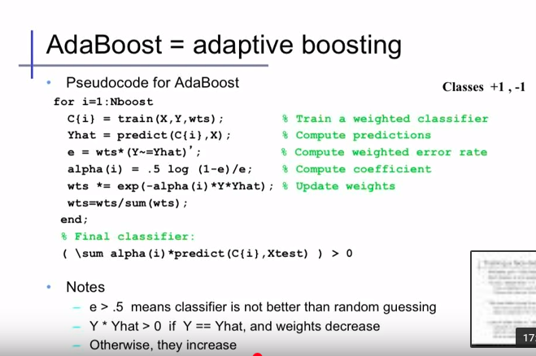

## Boosting

资料

- [深入浅出ML之Boosting家族](http://www.52caml.com/head_first_ml/ml-chapter6-boosting-family/)

## AdaBoost

[视频链接](https://www.youtube.com/watch?v=ix6IvwbVpw0)

**关键词**

- 依次训练多个分类器，每次都对前一个作改进
- 错误分类的样本权重变大，正确分类的样本权重下降
- $\alpha$
- 指数损失函数
