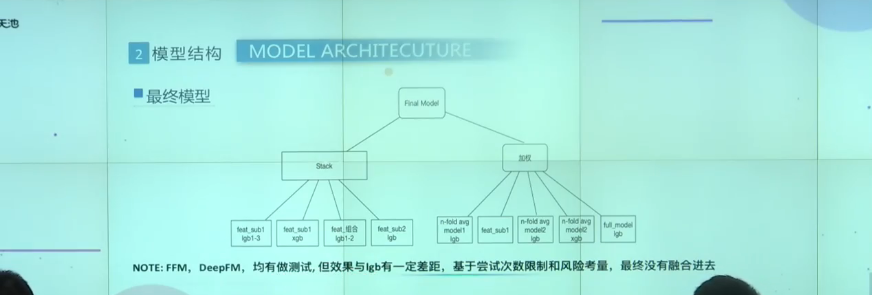
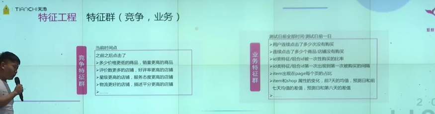

## 队伍1

### 数据划分方式

1. 用第7天上午训练

优点：训练数据的分布十分接近下午测试数据的分布
缺点：这个题目是个时序问题，这样划分体现不了如小时啊这种时间特征

2. 前七天也用来训练

优点：与第一种划分方式互补，可以体现小时特征
缺点：前七天数据分布与双十一差距比较大

所以两种方式都使用，最后做融合

### 数据清洗

**缺失值处理两个方面**

- 连续值：均值
- 离散值：众数/中位数

**具体**

1. 同一商品一天有两种销量，-1和5，-1是缺失值，用5填充
2. 同一用户出现多次，有些数据里面的属性值有缺失，用该用户数据的非缺失值的众数代替
3. train和test分布差异小的-1属性值保留（城市、品牌）

### 特征工程

**数据处理**

- 有些模型需要做归一化所以要做归一化

- 这里将时间分为上午下午晚上，可以避免对小时的过拟合，增加鲁棒性
- 可以看到，离散之后，店铺评价与转化率呈很好的线性关系，鲁棒性强
- 离散之后可以做交叉特征

- 提取实体，其实远远不止这五种实体
- 有了实体，就可以方便地结合业务场景想它们之间的交互，想特征
- 重视用户的点击，即使不发生购买但是反映倾向

组合特征

rank特征是这样的，比如说这个商品，在衣服这个类目中，按销量排序是第34位，做归一化34/1000=0.034，这个就是我们得到的新的rank特征，这个体现了销量或者价格在整个序列中的位置

转化率

使用滑动窗口，统计前七天的，前几个小时的

将双十一当天的样本权重加大

---

用户对某个属性搜索几次，所有用户对某个属性搜索几次

### 个人总结

**数据划分**：

两种结合要比单单使用7号的要好。但是单用0-10点提取特征有可能捕捉不到下午和晚上的分布。

**特征工程亮点**：

- 对时间做binning，分为上午下午晚上，避免对小时的过拟合
- 离散之后，店铺评价与转化率呈很好的线性关系，鲁棒性强。这个是我没料到的。
- 对item的商品和品牌做了转化率
- 使用了xgb的权重设置
- 在predict_category_property上，构建了统计、组合、比值特征
- 时间粒度划分得很细（10分钟、30分钟、1小时、2小时）

---

强东队

连乘容易导致梯度爆炸和梯度消失，可以通过乘以log解决

### 个人总结

**亮点**

- 这个解决方案重点在深度学习上
- 一个模型大融合
- 觉得还有改进空间，比如说答辩选手提到训练数据不够。可以用第一名的迁移学习解决。
- 答辩中提到的DL模型调试的trick值得一学

---

躺分队

采用acc与logloss两种验证方法，当两个指标都同时变好的时候，就采用这个特征。这在比赛中取得了线上线下同增减。

协同过滤？

---

禁止实习咋找工作

---

learner_ctr

---

蓝鲸烧香队

大部分都是一次点击然后就买了的，说明是即时兴趣，目标明确

提取出现次数最多的top10 property。第一个property作为一个特征，第一第二个拼接作为第二个特征。。。如此得到10个新特征

而对于predict_category_property来说，是取去最先出现的前十个，如上构造新特征

item一级类目做一个特征，二级类目做一个特征

可以看到，前6天的各个小时点击数的趋势是差不多的，几乎重合。所以小时也很重要的

将时间信息模型的预测结果作为特征给前两个模型

用cvr乘以a调整最后的答案（就是那个调整）
