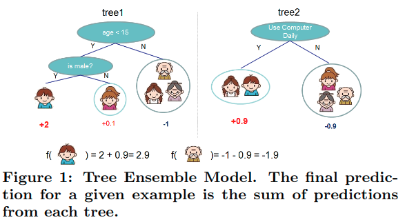
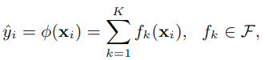
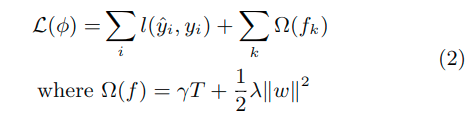
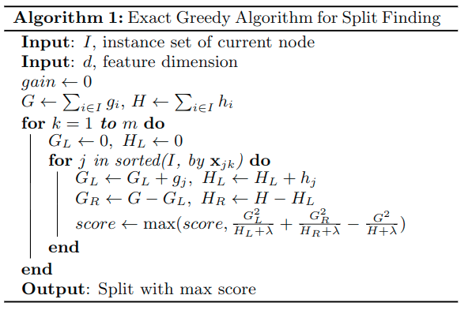
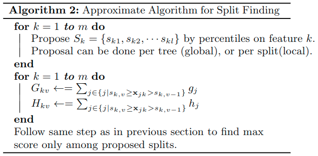

# Intro

惯例吹水。

主要贡献如下：

- We design and build a highly scalable end-to-end tree boosting system.
- We propose a theoretically justified weighted quantile sketch for effcient proposal calculation.
- We introduce a novel sparsity-aware algorithm for parallel tree learning.
- We  propose  an  effective  cache-aware  block  structure for out-of-core tree learning.

# 2. Tree Boosting In A Nutshell

### 2.1 Regularized Learning Objective

假设数据集

- 数据集大小 = n
- features = m
- $D = \{(x_i, y_i)\}(|D| = n, x_i \in R^m, y_i \in R)$

Fig.1的tree ensemble model使用K additive functions去预测输出：

- $F = \{f(x) = w_{q(x)}\}(q:R^m \to T, w \in R^T)$是回归树的值空间
- $q$代表了每个树的结构，它将一个example映射到对应的leaf index
- $T$是树上的叶子数
- $w_i$表示第i-th叶子的score
- 每个$f_k$对应着独立的树结构$q$和叶子权重$w$

为了训练模型，我们需要**最小化下面的regularized objective**

- $l$是可微的凸损失函数
- $\Omega()$惩罚模型的复杂度，避免over-fitting
- Regularized Objective倾向于选择简单又预测得好的模型
- 当

### 2.2 Gradient Tree Boosting

等式2将函数作为参数，并且不能在欧氏空间中用传统的优化方法优化(不懂)。取而代之的是，

$$L^{(t)} = \sum_{i=1}^n l(y_i, \hat{y_i}^{(t-1)} + f_t(x_i)) + \Omega(f_t)$$

- $\hat{y_i}^{(t)}$ 表示第$i$-th个实例在第$t$-th轮迭代中的预测值
- 公式的意义是，对第$i$个instance，根据$t$-1轮的结果$\hat{y_i}^{(t-1)}$，加上本轮($t$)对应的权重，构成loss func。

后面是一系列这个公式的演化，回加上一阶二阶导，将l去掉。论文中并未详细介绍这么做的原因，所提及的引用文献也没时间看，先这样。

### 2.3 Shrinkage and Column Subsampling

两个技术

- Shrinkage
- Column Subsampling

**Shrinkage**

在每一步tree boosting后加上权重$\eta$。与学习率在随机优化中相似，shrinkage减少了每个单独的树和叶子空间对未来的树的影响，从而提高了模型。

**Column Subsampling**

这个技术在RandomForest里面也用到，它在防止over-fitting上比传统的row sub-sampling更好。应用这项技术也提高了后面提到的平行算法的运算速度。

# 3. Split Finding Algorithms

### 3.1 Basic Exact Greedy Algorithm

对于树学习来说，有一个关键问题是怎么找到最好的分割点。这里用的是**exact greedy algorithm**

它会严格计算连续特征所有可能的分割点。为了高效地计算，算法必须先对data根据特征值排序。

### 3.2 Approximate Algorithm

**exact greedy algorithm** 很强大，因为它贪婪地枚举了所有可能的分割点。但是这样很吃资源。

为了解决这个问题，我们总结了一个近似的算法(Algorithm 2)
