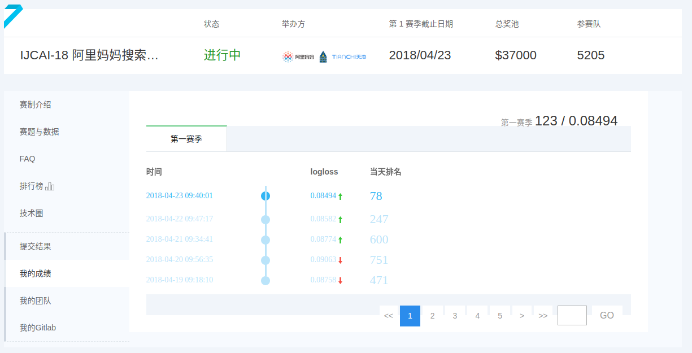

## 比赛总结

初赛终于结束了，头一次如此投入去打比赛，这一个多月以来真是痛并快乐着。最大的感悟是：构造线下验证集并没有什么用，做了一堆工作还不如一个leak。首先取得这个成绩算是给自己一个交代了，圆了之前腾讯社交算法大赛的遗憾。

#### 在比赛过程中主要遇到的一些问题

**1. 数据预处理**

对缺失值进行处理，分割某些拼接一起的特征，比如item_property_list，丢弃一些没有用的特征（缺失值非常多，或者取值几乎一样的）。清洗缺失值比较多的数据。

对于数据不平衡的问题，一开始我尝试通过上采样下采样解决，效果变差。通过查资料推测是采样方案不好导致的。现在lgb自带用于处理不平衡数据集的采样技术，所以方便了很多。

**2. 如何构造特征**

这个部分是最耗精力的。 **必须要** 摸清线上测试集的分布。

还有就是，比如说统计特征对a榜无效，在b榜中起到的作用也不大。a榜花了大量的时间其构造统计特征以及交叉特征，线下效果还不错，线上效果很有限。这个时候就要考虑一个问题：线上测试集的分布跟线下是否不一致。当时官方直播讲解的时候说到测试集是按用户抽取的，于是我就按测试集出现的用户在训练集采样，用来训练模型。第二天线上直接崩了。现在想来，当时那几天有些疯狂，颇有些一不做二不休的节奏，不过整个比赛最刺激的就是这些疯狂的尝试，也给我打击最大。其实即使要做采样，也应该另外在剩下的数据集中抽取30%合并在一起构成a榜的训练集。可惜每天只能提交一次，后来有很多想法都没来得及验证。

至于转化率，做了全局的，在a榜作用不大，后来b榜提交次数太有限了没有实验。下听说是需要按天计算才起效，这个我还没来得及试验。

还有就是，要观察训练集有没有什么规律。说不定你会发现leak。b榜开始后，我将所有想到的能尝试的办法，基本上都尝试过了，分数勉强进复赛。后来有个人在群里面说了句“用户距离下一次点击的时间，贼猛”，我立马做了实验，效果非常好。这让我开始注意时序，然后发现了在各种比赛经验上面经常提到的leak。我刚发现数据的这个规律时并不知道这是个leak，后来发现这个上分有点猛，才明白这是leak。然后就围绕着这个leak做了许多的特征，最后两天从几百名开外一直冲到一百多名，后面就明白了前排为什么会效果这么好了。在这上面多做点文章，基本上就能上榜了。

**3. 如何验证特征的有效性**

- a榜前半部分使用xgb来筛选特征，结果不是十分稳定。后期使用cv来验证特征的有效性，取得比较好的效果。但是考虑到有些特征需要一起使用才会有效，所以最好结合两者构造比较好的特征验证方案，这个非常重要。
- 特征并不是越多越好，不好的特征就相当于引入了噪声，会使结果变差。大胆的丢掉没用的特征，后面再挖掘它们的作用。

**3. 模型融合**

模型融合的方法有很多，常规的就是stacking和blending

**4. 管理好代码**

维护代码是个成本很高的工作，所以在写的时候就应该考虑到以后的拓展和使用

**5. 交流十分重要**

整个初赛的转折点，是在加了一个跟我一样在复赛线徘徊的选手。在跟他交流的过程中我注意到了很多我忽略的问题。

不得不说交流能力真的很重要，连跟其他人扯淡都扯不下去，那么其他的情报也就不用说了。

#### 最后

基本就是这样了。虽然不算很好，不过取得这个成绩还是出乎我意料的。新手做比赛确实挺累的，最好有个老司机带。看着自己辛辛苦苦做出来的特征线下很美好，线上却崩掉的时候，是挺崩溃的，会迷茫。这个时候需要坚持，然后好好理顺逻辑分析一下原因。

复赛应该是没时间做了，这一个月以来是顶着导师的压力私底下打的比赛，接下来要好好干活。秋招也快要开始了，要好好准备，扎实的基础是一切的根本，不管是比赛还是找工作都是的。
