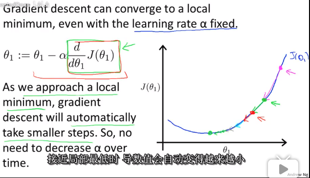
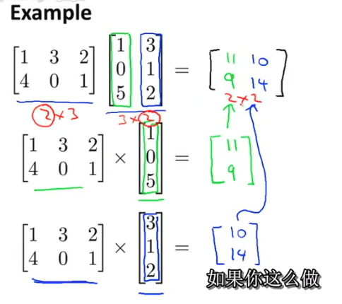
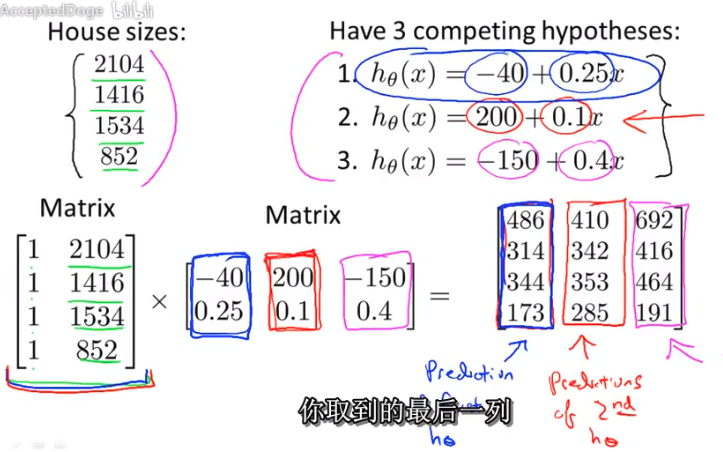
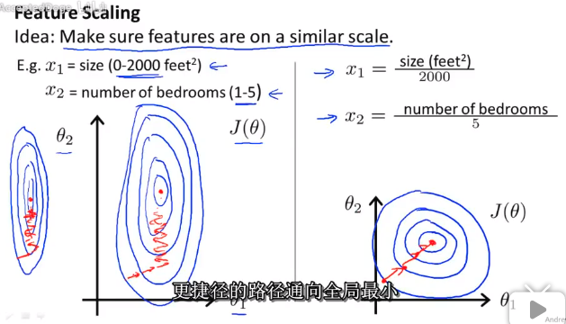
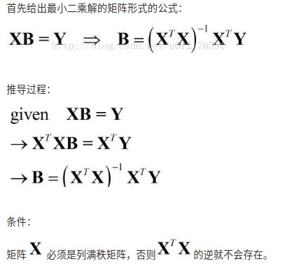

## Gradient Descent

以前没想到这种现象。话虽如此，适当的学习率还是需要的，不然有可能会冲过最优值。

---

所以你可以这样用：

---

对数据做归一化欧神经网络会收敛得更快。下面给一个没做归一化时的cost function。在梯度下降的时候，会如图反复振荡，花更长的时候达到最优值：

还有一个需要注意的地方

后面还提到，如果你使用解方程的形式求最优值，也就是(4-6)所讲的**normal equation**，那么特征做不做归一化都没什么问题。但是如果你用gradient descent就不行了，不做归一化有可能会出现上图的问题。

---

## 4-6 Normal Equation

初见这个式子不知道是啥

$$\theta=(X^TX)^{-1}X^Ty$$

原来是最小二乘法的矩阵形式，推导如下

