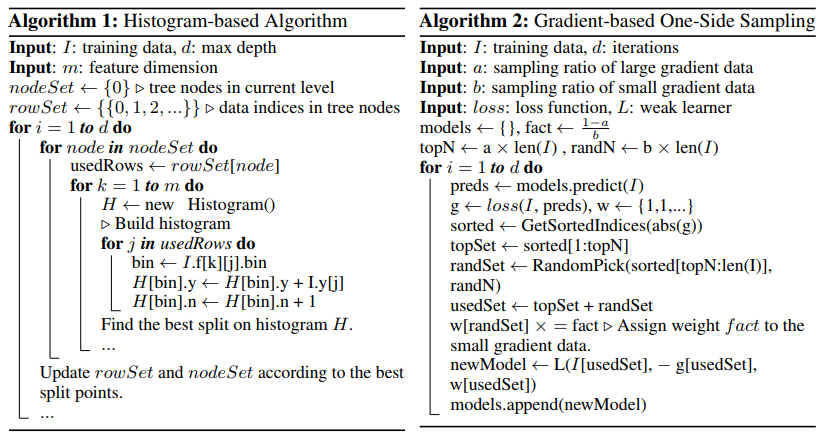
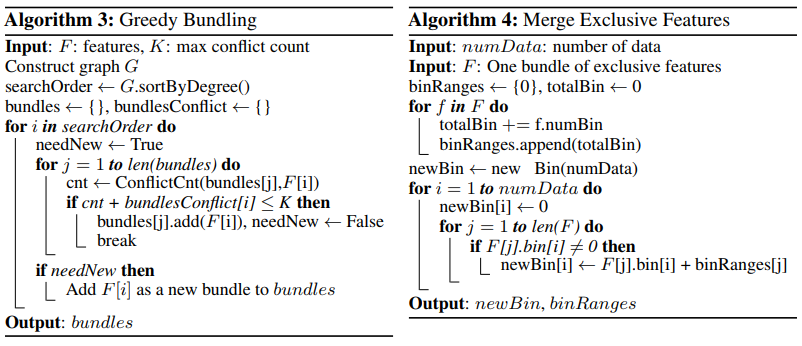

---
html:
  embed_local_images: true
  embed_svg: true
  offline: false
  toc: true

print_background: true
---

- [原文连接](https://papers.nips.cc/paper/6907-lightgbm-a-highly-efficient-gradient-boosting-decision-tree.pdf)

# LightGBM: A Highly Efficient Gradient Boosting Decision Tree

## Abstract

虽然目前已经有比较高效的GBDT实现，如XGBoost和pGBRT，但是在特征维度很高数据量很大的时候依然不够快。一个主要的原因是，对于每个特征，他们都需要遍历每一条数据，对每一个可能的分割点去计算信息增益。为了解决这个问题，本文提出了两个新技术：*Gradient-based One-Side Sampling*(GOSS)和*Exclusive Feature Bundling*(EFB)。

有了GOSS，我们去掉了很大一部分梯度很小的数据，只使用剩下的去估计信息增益(这里不会受长尾的影响吗？)。我们证明了，由于梯度大的数据在计算信息增益的时候更重要，所以GOSS在小很多的数据上仍然可以取得相当准确的估计值。

有了EFB，我们捆绑互斥的特征(i.e.，他们经常同时取值为0)，以减少特征的数量。我们证明了，对互斥特征寻找最佳的捆绑方式是一个NP难问题，当时贪婪算法可以取得相当好的近似率(因此可以在不显著影响分裂点选择的准确性的情况下，显著地减少特征数量)。

我们叫这种带有GOSS和EFB的新GBDT算法为LightGBM。我们在多个公共数据集的实验显示，Lightgbm在准确率相近的情况下，比常规的GBDT快了近20倍。

## 2 准备知识

### 2.1 GBDT and Its Complexity Analysis

GBDT是一个关于决策树的集成模型。在每一次迭代，GBDT会根据负梯度（也称残差）来学习决策树。

在训练GBDT中，最耗资源的是学习决策树和寻找决策树的最佳分割点。一个寻找分割点的最流行的算法是*pre-sorted algorithm* [8][9]，它在pre-sorted的特征值上枚举所有可能的分割点。这个算法虽然简单也可行，但是不高效。另一个比较流行的算法是*histogram-based algorithm* [10][11][12]，它讲连续的特征值编入到离散区域中，并在训练中用这些区域构建特征直方图。由于后者更高效，所以我们基于此开展我们的工作。

>As shown in Alg. 1, the histogram-based algorithm finds the best split points based on the featurehistograms. It costsO(#data#feature)for histogram building andO(#bin#feature)forsplit point finding. Since #bin is usually much smaller than #data, histogram building will dominatethe computational complexity. If we can reduce #data or #feature, we will be able to substantiallyspeed up the training of GBDT.

### 2.2 Related Work

#### 2.2.1

相关的GBDT实现有：

- XGBoost --> pre-sorted algorithm and histogram-based algorithm
- pGBDT --> histogram-based algorithm
- scikit-learn --> pre-sorted algorithm
- gbm in R --> pre-sorted algorithm

其中XGBoost是在这之中表现最好的，所以我们用它来作为baseline。

#### 2.2.2 有几个问题

**如何减少数据量**

常用的减少训练数据量的方式是down sample。例如在[5]中，权重小于阈值的数据会被过滤掉，SGB在每一轮迭代中用随机的子集训练弱学习器；在[6]中，采样率会在训练过程中动态调整。但是，所有这些工作除了SGB外都是基于AdaBoost的，并且由于GBDT没有数据实例的权重，所以不能直接运用到GBDT上。虽然SGB可以应用到GBDT，但是它这种做法对acc影响太大了。

**如何减少特征**

类似的，为了减少特征的数量，需要过滤若特征[22, 23, 7, 24]。这通常用PCA和projection pursuit来做。可是，这些方法高度依赖一个假设，那就是特征包含相当多的冗余的信息。而这个假设在实践中通常不成立（因为通常特征都被设计为具有独特作用的，移除了哪个都可能对训练的acc有影响）

**关于稀疏的数据**

现实应用中的大规模数据通常是相当稀疏的。使用pre-sorted algorithm的GBDT可以通过忽略值为0的特征来降低训练的开销。而使用histogram-based algorithm的GBDT没有针对稀疏数据的优化方案，因为histogram-based algorithm无论特征值是否为0，都需要检索特征的bin值，所以它能够有效地利用这种稀疏特性。

为了解决上面的这些问题，我们提出了两个新的技术——GOSS和EFB。下面会详细介绍。

## 3 Gradient-based One-Side Sampling

这里，我们介绍一种用于GBDT的新的抽样方法，它在保证acc的情况下减少了数据量。

简而言之，GOSS保留了梯度较大的数据，而从梯度较小的数据中随机抽样。为了补偿对数据分布的影响，在计算信息增益时，为梯度较小的数据引入一个常数。具体来说，GOSS根据每个数据实例的梯度排序，选择top$a \times 100\%$的实例。然后从剩下的数据中随机抽样$b \times 100\%$的实例。然后，在计算信息增益的时候，GOSS会将梯度小的那部分数据乘上$\frac{1-a}{b}$，起放大的作用（$a, b < 1$）。详情看Alg.2

## 4 Exclusive Feature Bundling

本节我们介绍一个新方法显著地减少特征数量。

高维度的数据通常是非常稀疏的，特征空间的稀疏性让我们可以设计一个几乎无损的方法去减少特征的数量。具体来说，在稀疏的特征空间中，许多特征是互斥的，i.e.，他们从不同时取非零值。所以我们可以安全地将互斥特征捆绑到一个特征中（我们称之为*exclusive feature bundle*）。通过仔细地设计特征扫描算法，我们可以像独立特征一样给feat bundles建立feature histograms。这样做之后，histogram building的算法复杂度从$O(\#data \times \#feature)$变为$O(\#data \times \#bundle), \#bundle << \#feature$。这样，我们就可以在不降低acc的情况下显著地提高GBDT的训练速度。

