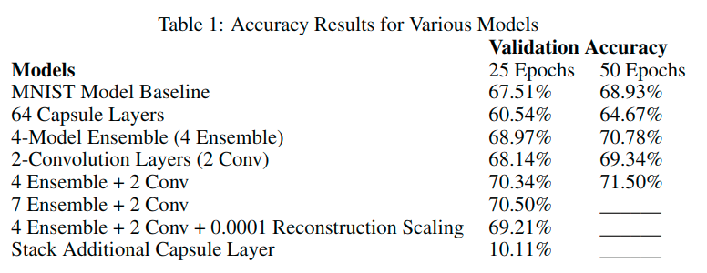
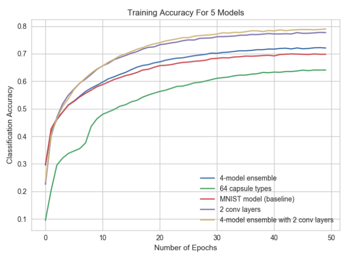
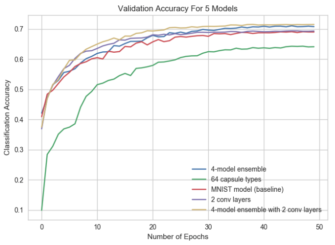
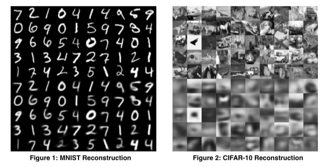

---
html:
  embed_local_images: true
  embed_svg: true
  offline: false
  toc: true

print_background: true
---

[toc]

# Capsule Network Performance on Complex Data

- Edgar Xi, Machine Learning Department, Carnegie Mellon University
- Selina Bing  Yang Jin, Computer Science Department, Carnegie Mellon University

### Introduction

**CNN存在的问题**

- CNN忽略了层内的层级结构（人脑里面就有这样的结构）
- 缺乏旋转不变性

为了解决这个问题，Hinton等人最近提出了CapsNet，一种使用capsule的新型神经网络

### Capsule Networks概览

**主要创新点**

- 使用capsule作为基本组件
- 使用向量输出替代标量输出
- 使用routing by agreement替代max-pooling

**Dynamic Routing**

capsule输出一个向量，并且可以选择将信息传送到上层的那个capsule。对于每个潜在的parent，capsule network可以增加或者降低连接强度。这种routing by agreement机制在添加方差方面比max-pooling更加有效。

**Reconstruction Regularization**

传统CNN使用dropout避免过拟合，而Capsule通过重构自动编码器来达到同样的目的。在训练时，除了正确的数字对应的向量外，其他向量都被屏蔽。这个正确数字对应的向量会被用来重构为图像，根据重构的结果来计算loss。这是的网络能够学习更一般话的图像表示。

### Methodology

本文实验对CapsNet做了以下调整

- 使用更多胶囊层
- 增加PrimaryCaps的capsule数量，使其学习到更丰富的特征表达
- 整体平均（Ensemble averaging）：一组网络一起训练，取结果的平均值
- 调整重构损失的比例，分析缩放银子对过拟合和收敛速度的影响
- 增加胶囊层之前的卷积层数量
- 使用自定义的激活函数$f(x)=(1- \frac{1}{e^{|x|}} \frac{x}{|x|})$，使得极寒函数对x的微小变化更敏感，从而导致更大的类别区分度
- 增加一个类别：胶囊倾向于解说图像中的所有内容，因此增加一个类别可以提高准确性（猜测是将不相关的噪声信息都归入到了这个类别当中，我之前做实验尝试过这种方法，并没有取得多少提升）

### 实验结果

实验部分将上面提到的调整分别进行实验，其中“Ensemble”包含了增加一个类别的方法。结果如下：

并没有取得预期效果，大部分仅带来了一些提高。稍好的是增加卷积层和Ensemble，其有效的根本原因是由于更复杂的特征表达。与预期相反，堆叠额外的胶囊层和使用自己的激活函数使得表现大幅下降。降低重构占loss的比重和增加一个类别均低于预期。

**Reconstruction**

图片上半部分是原始数据，下半部分是重构的图像。可以看到，对MNIST的重构是比较成功的，而对CIFAR-10这种复杂数据的重构就比较糟糕，从而导致了reconstruction loss，这也是影响模型表现的一部分。因此，对于复杂的数据，应该使用更复杂的重构模型。
