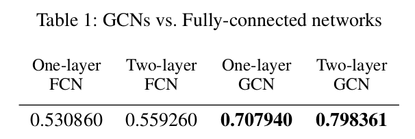
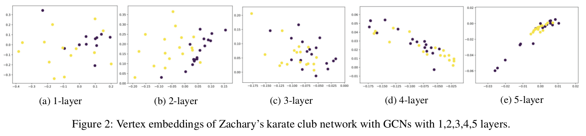
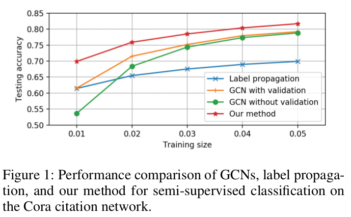
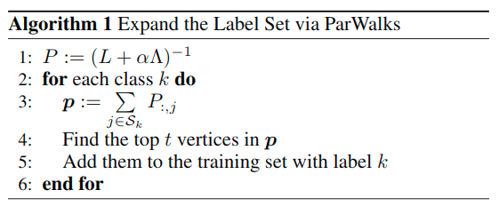
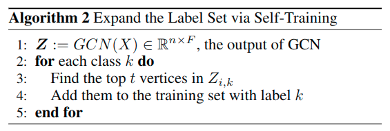

---
html:
  embed_local_images: true
  embed_svg: true
  offline: false
  toc: true

print_background: true
---

[toc]

# Deeper Insights into Graph Convolutional Networksfor Semi-Supervised Learning

## Abstract

本文，我们深入探讨GCN的原理和指出它的基本限制。主要有

1. graph convolution是Laplacian smoothing的特殊形式，这是GCNs为什么会有效的主要原因。但这也带来了多个卷积层会导致过度平滑的隐患。

2. 为了克服浅层架构的GCn的局限性，我们提出了co-training+self-training的方法去训练GCNs。

我们的方法通过极少数标签显著提高GCN的学习效率，并且不需要额外的标签做验证。

## 1 Introduciton

众所周知，训练深度神经网络需要大量有标签的数据，但是在许多场景下，标记数据成本太高了。为了减少训练所需要的数据量，最近的研究集中在fewshot learning——从很少的数据中学习分类模型。fewshot learning与半监督学习很相似。

许多研究表明，**如果适当地利用无标签数据训练，可以显著提高训练acc，关键问题是如何最大限度地利用无标签数据的特征**。有关半监督的可以看这几篇论文：

- Semi-supervised learningwith ladder networks
- Deep learning via semi-supervised embedding
- Revisiting semi-supervisedlearning with graph embeddings
-  Semi-supervised classification with graph convolutional networks

本文，我们会说明

1. GCN是Laplacian smoothing的特殊形式。smoothing操作使得同一个cluster内的顶点的特征趋于相似，从而大大简化了分类任务。这是GCNs表现这么好的关键原因。但是，如果conv层太多，输出特征就会被over-smoothed，不同cluster的顶点会变得难以区分。
但是太少的层数，例如两层GCNs，也有它的局限性。（这个局限性我没搞懂，下文再看详细的）

2. 为了克服浅层架构的GCNs的局限性，我们提出了co-training+self-training的方法去训练GCNs

## 2 Preliminaries and Related Works

略

## 3 Analysis

### Why GCNs Work

因为用了Laplacian smoothing。Laplacian smoothing将自己的特征和邻居的特征加权平均再相加。由于在**同一个cluster里面的顶点一般是密集地连接的（关键前提）** ，所以smoothing操作可以使得它们的特征变得相似，从而更容易做分类。

而2层GCN则进一步使得同一个cluster里的顶点的特征变得相似，所以再加一层还会有提升。

### Why GCNs Fail

**一方面，多层GCN比较难训练**。由于graph conv是一个本地过滤器——邻节点特征的线性组合，只有少量label的浅层的GCN没办法充分地将标签信息传播到整个图。从头Fig.1可以看到，随着training data减少，GCN的表现迅速下降。也可以看到，GCN下降得比label propagation快得多。由于label propagation只是用了图信息，而GCN使用了结构和顶点的特征，这反映了GCN没办法学习全局的图解钩信息（what？）。

**另一方面，多次的Laplacian smoothing会混杂不同cluster的特征，从而使得他们难以分辨**。可以证明，多次应用Laplacian smoothing后，顶点的特征会收敛成同样的值。在symmetric Laplacian smoothing的例子中，他们将收敛成与顶点度平方根成比例的值。

**还有就是，GCN需要额外的validatiion set来作为early stopping的依据**。如果不适用val set训练GCN，其表现会显著下降（如Fig.1所示。但是我觉得也没降太多啊，不过确实要更陡峭一些）。

## 4 Solutions

下面两个方法都是为了让GCN能够看到更多的信息。

### Co-Train a GCN with a Random Walk Model

用的是absorbing random walks，即ParWalks（论文链接：[Learning with Partially Absorbing Random Walks](https://papers.nips.cc/paper/4833-learning-with-partially-absorbing-random-walks.pdf)）。论文中表示，何时的absorption setting可以很好地捕捉到全局图结构。还有一些优点需要看原论文才看得明白。

如Alg.1所示

- $P = (L + \alpha \Lambda)^{-1}$是归一化的absorption probability matrix。$\Lambda$的选择取决于数据。
- $P_{i,j}$表示$i$和$j$属于同一个类的概率
- $S_k$表示class k带标签的数据集
- $p_i$表示顶点$i$属于类别$k$的置信度

所以这个算法首先是计算概率矩阵$P$，然后对每个类别$k$，计算。。。好吧后面看不懂，我大概明白的是，它计算节点与类别$k$中的每个节点属于同一个类的概率，然后选出概率最大的几个，加入到类别$k$中作为标签数据。

### GCN Self-Training

简而言之，Alg.2的目的与Alg.1的目的是一样的，都是为了增加标签数据。Alg.1是通过random walk然后计算置信度取top n，而Alg.2就是直接用GCN的预测结果，去其中top t最可靠的，加入到标签数据中。

## 小结

好了，整篇文章就是介绍了GCN之所以起作用是因为有Laplacian smoothing以及如何更好地训练GCN——通过Co-Train和Self-Train来增加标签数据，从而不需要使用额外的val data。

现在还有一个问题，训练好GCN需要多少标签数据？

假设GCN有$\tau$层，底层图的平均度为$\hat{d}$，label数量的下界为$\eta=|V_l|$，而$\eta$通过解$(\hat{d})^{\tau} * \eta \approx n$得到。这背后的基本原理是估计一个$\tau$层GCN需要多少个标签数据来将它们传播到整个图。

# ATTENTION！

或许可以像lightgbm一样，从梯度的角度筛选节点
