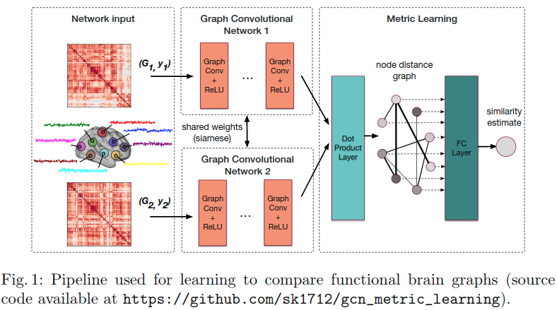

# Distance Metric Learning using Graph Convolutional Networks: Application to Functional Brain Networks

## 贡献

本文主要介绍一种度量两个graph之间相似性的度量学习方法。贡献主要有：

1. 使用了graph convolution neural network
2. 应用了 [8] **Learning local image descriptors with deep siamese and triplet convolutional networks by minimising global loss functions** 中提出的global loss function。该loss func对离群点具有更好的鲁棒性，提供了更好的regularisation。

## 主要内容

**Network Architecture**

如图所示，两个graph分别作为两个共享权重的GCN的输入，然后将这两个GCN的输出做内积，作为FC层的输入。FC层使用sigmoid作为激活函数，负责整合前面的filter所提供的图的全局相似性信息。每个GCN后面都有一个非线性激活函数，例如ReLU。

**Loss Function**

$$J^g = (\sigma^{2+} + \sigma^{2-}) + \lambda \mathop{max}(0, m-(\mu^+ - \mu^-))$$

- $\mu^+$表示两个属于同class的embedding之间的平均相似度
- $\mu^-$表示两个属于不同class的embedding之间的平均相似度
- $\sigma^{2+}$表示每对同类样本之间的相似度的方差
- $\sigma^{2-}$表示每对不同类样本之间的相似度的方差
- $\lambda$是平衡均值和方差的权重项
- $m$是均值项的margin
- 还有可以额外加上FC层参数的$l_2$正则项

这个loss function可以惩罚不同类之间的相似性，鼓励同类之间的相似性。由于它求的是全局的均值和方差，所以称之为global loss functions。
