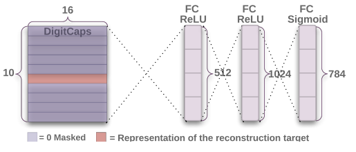

# Dynamic Routing Between Capsules 中文翻译

* 仅仅是看论文过程中一些比较难理解的段落顺便翻译一下，未经修改整理，请勿当真请勿当真请勿当真

### Abstract

胶囊是一簇神经元，它的激活向量（activity vector）表示了特定实体的实例化参数（instantiation parameters），例如对象或者对象的一部分这种实体。我们用激活向量的长度表示实体存在的概率，用它的方向（orientation）表示实例化参数。同一层激活的胶囊通过矩阵转换，为更高层的胶囊的实例化参数做预测。当多个预测都是相同的时候（When multiple prediction agree），更高层的胶囊就会被激活。

通过判别式训练（a discriminiatively trained），多层胶囊系统在MNIST上取得了state-of-the-art的成绩，并且在高度重合的数字图像中的识别比CNN还要好。

取得这些成绩是因为我们采用了iterative routing-by-agreement mechanism：底层capsule A倾向于跟某些高层capsule B相连，这些高层的capsule B的activity vector跟底层capsule A的prediction有很大的标量积

### 1 Introduction

人类视觉会通过使用仔细确定的数据，以确保只有很少一部分数据会到达最高层进行处理。

active capsule中的神经元的activities表示在图片上的实体的性质。这些性质包括各种不同种类的instantiation parameter，例如位置、大小、方向、形状、速度、反照率、颜色、纹理等等。比较特别的属性是在图片里面存在instantiated entity。可以用单独的logistic unit的输出概率去表示其存在。在文章中我们探索了一个有趣的替代方法，我们用instantiation parameter向量的总长度表示实体存在的概率，向量的方向表示实体的属性。我们用了一个方法确保capsule输出向量的长度不超过1，这种方法可以确保原来的向量方向不变，但是缩小标量

capsule的输出是一个向量，所以它能够用动态路由机制去给合适的上层parent传递消息。低一层的capsule的输出是传给所有possible parents，我们用耦合系数使得这些概率相加等于1。对每一个possible parent，capsule通过让自己的output与W参数矩阵相乘计算出一个prediction vector。如果这个prediction vector与某个possible parent的output相乘

总的来说，记住两件事

* instantiation parameter的长度表示了实体存在的概率
* instantiation parameter的方向表示实体的属性

### 2 How the vector inputs and outputs of a capsule are computed

实现capsules的思想有很多种方式，论文里面只是介绍了一种非常直接的方式。

我们想用capsule的输出向量的长度表示概率，这个概率指的是当前输入中存在capsule代表的实体的概率。

log priors $b_{ij}$ 可以同时有差别地像其他参数一样学习。它们取决于两个capsule的位置和类型，但与当前输入图片无关。

### 3 Margin loss for digit existence

我们用instantiation vector的长度表示capsule的实体存在的概率。所以如果某数字出现在图片上，我们希望该数字类k的顶层capsule的输出向量比较长。为了实现这个目的，我们使用了separate margin loss：

### 4.1 Reconstruction as a regularization method

这一部分讲他们打算用reconstruction替代regularization。

我们用额外的reconstruction loss鼓励digit capsule编码输入数字的instantiation parameter。在训练过程中，我们mask除了正确的digit capsule以外的所有activity vector，然后，用这个正确的digit capsule的activity vector重构输入图像。
如何重构呢，方法是将digit capsule的输出放入由三个FC层组成的decoder（如下图所示）

然后最小化logistic units和pixel intensities之间的平方差之和（也就是reconstruction loss）。我们将这个loss减少0.0005，这样它就不会在margin loss里面占主要地位。

### Structure

