[toc]

<br>

## Intro

由于涉及比较多的公式，而github不支持MathJax或者LaTeX，所以如果想获得更好的阅读体验请安装chrome插件[GitHub with MathJax](https://chrome.google.com/webstore/detail/github-with-mathjax/ioemnmodlmafdkllaclgeombjnmnbima)，或者有更好的方法恳请告知。

本文记录了阅读论文[《*Dynamic Routing Between Capsules*》](https://arxiv.org/pdf/1710.09829)以及[naturomics的代码](https://github.com/naturomics/CapsNet-Tensorflow)的理解与收获，若有错误欢迎指出（wjy.f@qq.com），转载请注明出处。

若想通过视频快速了解，可以看看下面两个链接，讲得比较生动易理解（不过还是推荐读论文）：

- [Capsule Networks教程(by Aurélie)](https://www.bilibili.com/video/av16594836/?from=search&seid=12945685157419672339)
- [用Tensorflow实现Capsule(by Aurélie)](https://www.bilibili.com/video/av16820289/)

<br>

## Main

### CapsNet

<br>

#### 结构概述

论文仅仅是提出了一个可行的方案，目的是为了证明`Capsule`这个思想的可行性，目前还较为粗略，有很多改进空间。论文有两个比较突出的创新点：

- 采用 routing-by-agreement mechainsm 决定两层capsule之间的连接以及参数$c_{ij}$的更新方式
- 用向量输出替代标量输出

下图是论文中所采用的神经网络结构：

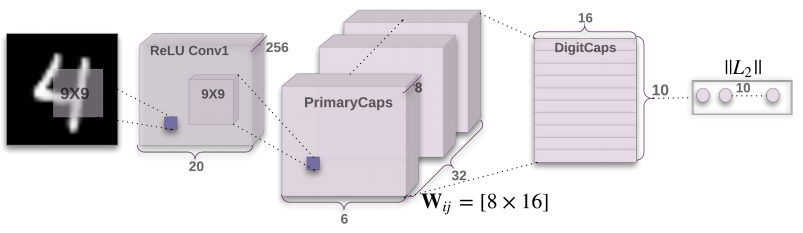

看完这幅图应该大概能理解CapsNet的结构。它先是对图像用了两次卷积得到PrimaryCaps，然后用*Routing-By-Agreement Mechanism*得到DigitCaps。最后，求DigitCaps中的10个向量的长度，比如说最长的是第4个向量，那么就意味着CapsNet识别出当前输入的图片是数字4。

看到这里，何为`Capsule`？在PrimaryCaps中，它指的是长度为8的向量，共6*6*32个。而在DigitCaps中，它指的是16维的向量，共10个。所以Capsule其实对应着传统神经网络的scalar，只是一个scalar能够表征的信息太少了，所以将其扩展为向量，这样它就能够表示更多的信息。有人说，之所以提出这种想法是因为Hinton观察到人的大脑不是像神经网络一样严格分层，而是一簇簇神经元作为一个整体的。

CapsNet的结构是Image(input)->Conv1->PrimaryCaps->DigitCaps(output)->Reconstruction，下文也会按照这个顺序来讲解

在下文中，若 i 指$layer_l$的某一个capsule ，那么 j 就是指$layer_{l+1}$的某一个capsule。

<br>

#### image to ReLU Conv1 to PrimaryCaps

论文使用的是MNIST手写识别数据集，每张图片的大小都是28*28。

流程：

1. image(28 * 28)

<br>

2. img $\to$ `Conv(num_outputs=256, kernel_size=9, stride=1, padding='VALID') + ReLU` $\to$ Conv1(256 * 20 * 20)

<br>

3. Conv1 $\to$ `Conv(num_outputs=256, kernel_size=9, stride=2, padding="VALID") + ReLU` $\to$ PrimaryCaps(256 * 6 * 6)

这里可能会有人奇怪，这里不过是用了256个filter产生256个feature map，图片为什么会画成(32 * 8 * 6 * 6)的形式，这是因为后面的路由算法是将一个长度为8的向量当做一个整体来计算的。

<br>

#### PrimaryCaps to DigitCaps & Dynamic Routing

- 下面讲解从PrimaryCaps $\to$ DigitCaps的计算过程，其中主要应用了*Routing-By-Agreement Mechanism*

**一张图表示他们之间的关系：**

<br>

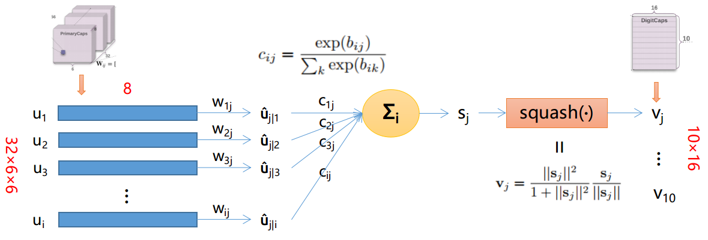

注意，图片中仅展示了一个$v_j,j\in(1,10)$的求解过程，其他$v_j$同理可得。

下面介绍其公式意义：

<br>

**公式**

 $$\hat{u}_{j|i} = W_{ij}u_i \tag{1}$$

- $u_i(i \in [6 * 6 * 32])$： 表示PrimaryCaps的某个8D的Capsule
- $\hat{u}_{j|i}$： 论文中称之为低一层的capsules的“prediction vectors”

$$c_{ij} = \frac{exp(b_{ij})}{\sum_kexp(b_{ik})} \tag{2}$$

- $b_{ij}$： 初始化为0，更新方法是$b_{ij} \leftarrow b_{ij} + \hat{u}_{j|i}v_j$。 其中$a_{ij} = \hat{u}_{j|i}v_j$表示$capsule_j$（即$v_j$）跟$capsule_i$的prediction vector（即$\hat{u}_{j|i}$）的agreement（契合度）。**值越大，表示两个向量的方向越相似，两个向量所表示的性质越相近**。由$c_{ij}$的公式知，$b_{ij}$ 的值越大（意味着两个向量的方向越相似），$c_{ij}$的值越大，**$capsule_i$ 越倾向于将信息传送给 $capsule_j$** 。
- $c_{ij}$： 由动态路由算法更新的coupling coefficients，并且$\sum_{i}c_{ij} = 1$（此时$j$为某确定的常数）

$$s_j = \sum_{i}c_{ij}\hat{u}_{j|i} \tag{3}$$

- $s_j$： $capsule_j$ 的所有input之和。

$$squash(s_j):v_j = \frac{\|s_j\|^2}{1+\|s_j\|^2}\frac{s_j}{\|s_j\|} \tag{4}$$

- $squash()$： 非线性函数，保留了向量的方向，使长的向量越长，短的向量越短，并且长度都压缩在0-1之内
- $v_j$： 由dynamic routing计算出来的PrimaryCaps的output。在文章中就是指最后的输出DigitCaps，共有10个（因为有10个数字，即10类）Capsule。每个capsule有16维，每一维都代表着数字的某些属性（粗细、倾斜程度等等）。**向量的长度代表了当前输入是类 $j$ 的概率**。

<br>

#### Dynamic Routing算法流程

<br>

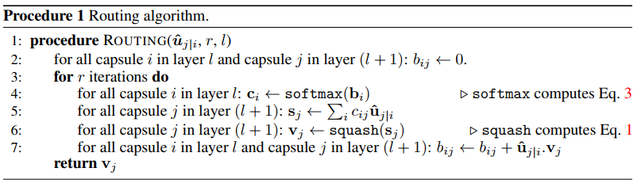

<br>

整个过程如下所示（图片来自[naturomics](https://github.com/naturomics/)的ppt）：

<br>

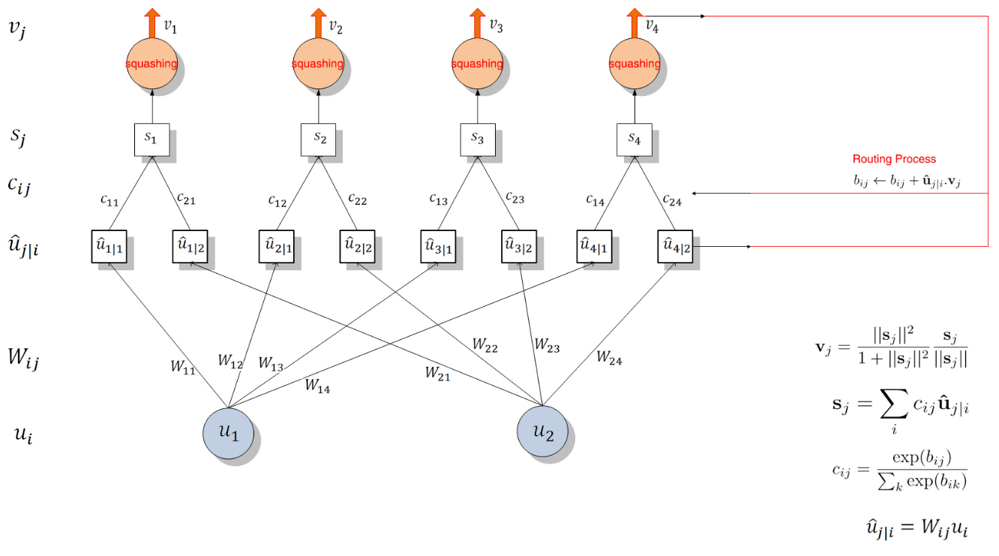

<br>

#### Reconstruction

CapsNet使用Reconstruction作为Regularization。其做法是将DigitCaps的十个输出向量$v_j$中长度最长的向量，经过3个FC层（结构如下图所示）重构出原来的图像，通过对比重构的图像和原图像的差异(pixel-wise)，得到reconstruction loss。用来重构的这三个FC层一起称为`Decoder`。

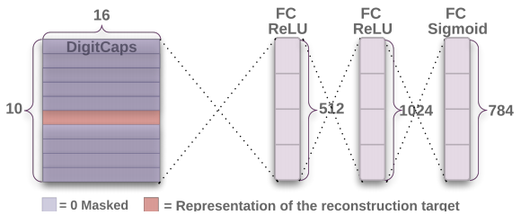

<br>

#### Total loss

由于有多个类的存在，所以不能用cross entropy，论文中使用了SVM中常用的损失函数Margin loss来代替

**Margin loss**

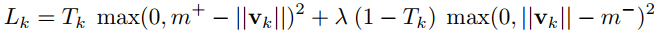

- k： class k，$k\in[1, 10]$
- $m^+=0.9, m^-=0.1$ （自己设定）
- $\lambda$ （比例系数，用来调整两者的比重）：
  >The λ down-weighting of the loss for absent digit classes stops the initial learning from shrinking the lengths of the activity vectors of all the digit capsules. We use λ = 0.5.

- 如果输入的数字图像是class k，那么$T_k=1$
- | 示例 | 输入输出 | $\|v_k\|$ | $L_k$ |
  | -- | --------------------- | ----- | ----- |
  | TT | 输入数字k 预测结果为数字k | 比较大 | 比较小 |
  | TF | 输入数字k 预测结果非数字k | 比较小 | 比较大 |
  | FT | 输入非数字k 预测结果为数字k | 比较大 | 比较大 |
  | FF | 输入非数字k 预测结果非数字k | 比较小 | 比较小 |
- 可以看出，在假阳性和假阴性的示例中，$L_k$的值比较大。

<br>

**Reconstruction loss**

计算原图像与重构的图像在对应的pixel位置上的值之差，求和得到Reconstruction loss

```python
将原图像x(28, 28)reshape成orgin(784)
再将重构的图像decoded(784)
squared = square(decoded - orgin)
reconstruction_loss = mean(squared)
```

即

$$Reconstruction Loss=\frac{1}{784} * \sum_{i=1}^{784}(decoded_i - orgin_i)^2$$

<br>

最后：

$$TotalLoss = MarginLoss + ReconstructionLoss$$


<br>

### 实验

**MNIST**

l=label, p=prediction, r=reconstruction。下面最右的两列展示了模式是如何在5和3之间纠结的。而其它列表明了模型不仅保留了图片的细节并且平滑了噪声。

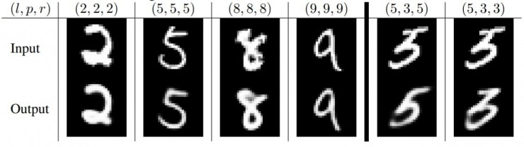

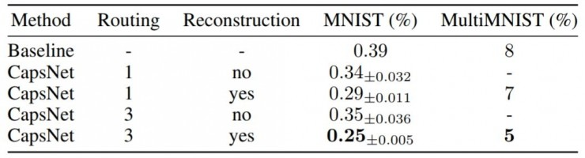

**Dimension perturbations**

改变DigitCaps中的capsule的16维中的一维，这个被改变的capsule所重构出来的图像也会有所变化（比如笔画变得更粗）。这表明了capsule学习到了entity，并且每一维都代表着entity的某个feature，具有很强的解释性。

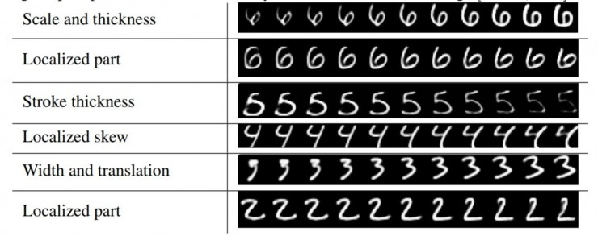

**MultiMNIST**

L指的是两个label，R指的是两个用于重构的图像。上面白色的是input image，下面红绿色重叠的是重构的图像。

如下图所示，实验把两个激活程度最高的capsule对应的数字作为识别结果，据此对识别到的图像元素进行了重构。对于左边中识别正确的样本（L指真实标签，R指激活程度最高的两个胶囊对应的标签），可以看到由于不同的capsule各自工作，在一个识别结果中用到的特征并不会影响到另一个识别结果，不受重叠的影响（或者说重叠部分的特征可以复用）。

另一方面，每个capsule还是需要足够多的周边信息支持，而不是一味地认为重叠部分的特征就需要复用。下图中间是选了一个高激活程度的capsule和一个低激活程度capsule的结果（* R表示其中一个数字既不是真实标签也不是识别结果，L仍然为真实标签）。可以看到，在（5，0）图中，关注“7”的capsule并没有找到足够多的“7”的特征，所以激活很弱；（1，8）图中也是因为没有“0”的支持特征，所以重叠的部分也没有在“0”的capsule中用第二次。

最右R:P:(2, 7)指的是预测结果是2,7，然后将代表2和7的capsule重构。

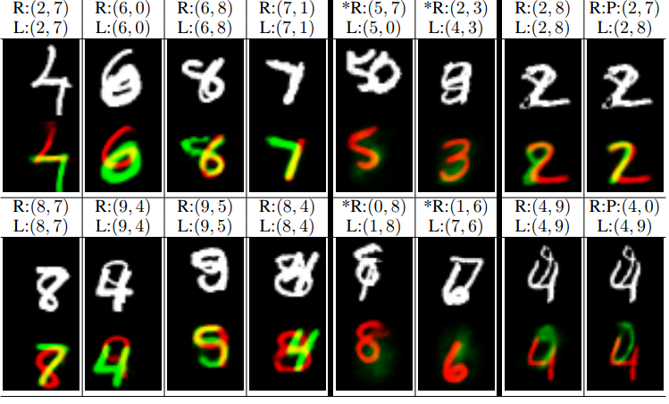

<br>

### CapsNet与tradictional neuron的对比

（图片来自[naturomics](https://github.com/naturomics/CapsNet-Tensorflow)）：

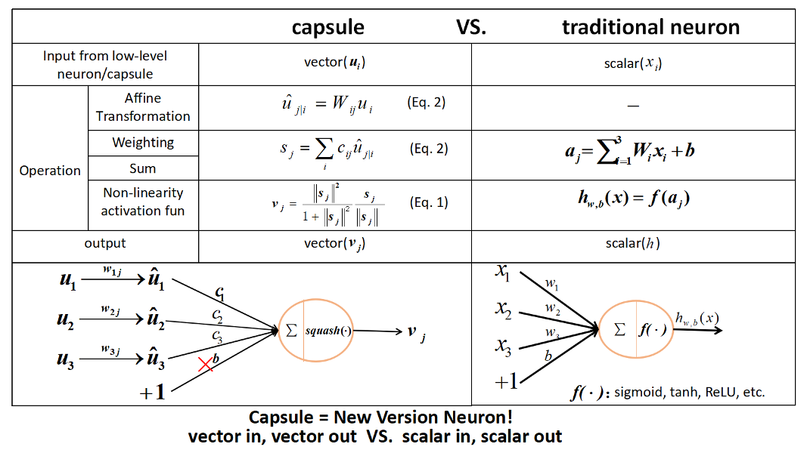

<br>

### 总结

**为什么要用Routing-by-agreement？**

传统的CNN里面，conv后面是max-pooling层，但是max-pooling只保留了唯一一个最活跃的特征，而Routing则有效得多。

Routing-by-agreement有以下几个好处：

- 由于上一层的capsule会逐渐倾向于将信息传到下一层与它相似的capsule，这样就能够给下一层capsule干净清晰的信号，减少噪声，从而更快地学习到entity
- 通过追溯当前被激活的capsule的信号传输路径，我们可以操控part-whole中的part，并且清楚知道哪一个part属于哪一个entity（比如说识别一个由三角形和长方形组成的房屋，在$layer l$可能有个capsule是检测三角形，有个capsule检测长方形，则在$layer l+1$有能够得到检测房屋的capsule。此为ppart-whole的关系）。
- 可以很容易地解析重叠的entity，比如重叠的数字识别。

>the capsules in the first layer try to predict what the second layer capsules will output

<br>

### 代码阅读

[代码link](https://github.com/naturomics/CapsNet-Tensorflow)

由于代码基本上都是按照文章思路来写的，所以不重复讲，而是介绍主要的结构。

**目录**

```
CapsNet-Tensorflow
  - capsLayer.py
      定义了capsLayer的实现方法。
      由于论文中提及的capsLayer有两种:
        PrimaryCaps(without routing)
        DigitCaps(with routing)
      所以该文件里面也包含了这两种Layer的实现方式
      另外，该文件还有:
        routing
        squash

  - capsNet.py
      定义了CapsNet类
      包含：
        build_arch()  # 定义结构
        loss()        # 定义loss

  - config.py
      超参数设定

  - main.py
      程序入口

  - utils.py
      用于读取MNIST的数据
```

主要代码：

```python
class CapsNet(object):
    def __init__(self, is_training=True):
        self.graph = tf.Graph()
        with self.graph.as_default():
            if is_training:  # 如果是在训练过程中
                self.X, self.labels = get_batch_data()  # 获取training data和label
                self.Y = tf.one_hot(self.labels, depth=10, axis=1, dtype=tf.float32)  # 对label做onehot

                self.build_arch()  # 搭建CapsNet的结构
                self.loss()        # 定义loss
                self._summary()

                # t_vars = tf.trainable_variables()
                self.global_step = tf.Variable(0, name='global_step', trainable=False)
                self.optimizer = tf.train.AdamOptimizer()  # 使用AdamOptimizer
                self.train_op = self.optimizer.minimize(self.total_loss, global_step=self.global_step)  # var_list=t_vars)
            elif cfg.mask_with_y:  # 如果是已经训练完
                self.X = tf.placeholder(tf.float32,
                                        shape=(cfg.batch_size, 28, 28, 1))
                self.Y = tf.placeholder(tf.float32, shape=(cfg.batch_size, 10, 1))
                self.build_arch()
            else:
                self.X = tf.placeholder(tf.float32,
                                        shape=(cfg.batch_size, 28, 28, 1))
                self.build_arch()

        tf.logging.info('Seting up the main structure')

    def build_arch(self):
        with tf.variable_scope('Conv1_layer'):
            # Conv1, [batch_size, 20, 20, 256]
            conv1 = tf.contrib.layers.conv2d(self.X, num_outputs=256,
                                             kernel_size=9, stride=1,
                                             padding='VALID')
            assert conv1.get_shape() == [cfg.batch_size, 20, 20, 256]

        # Primary Capsules layer, return [batch_size, 1152, 8, 1]
        with tf.variable_scope('PrimaryCaps_layer'):
            primaryCaps = CapsLayer(num_outputs=32, vec_len=8, with_routing=False, layer_type='CONV')
            caps1 = primaryCaps(conv1, kernel_size=9, stride=2)
            assert caps1.get_shape() == [cfg.batch_size, 1152, 8, 1]

        # DigitCaps layer, return [batch_size, 10, 16, 1]
        with tf.variable_scope('DigitCaps_layer'):
            digitCaps = CapsLayer(num_outputs=10, vec_len=16, with_routing=True, layer_type='FC')
            self.caps2 = digitCaps(caps1)

        # Decoder structure in Fig. 2
        # 1. Do masking, how:
        with tf.variable_scope('Masking'):
            # a). calc ||v_c||, then do softmax(||v_c||)
            # [batch_size, 10, 16, 1] => [batch_size, 10, 1, 1]
            self.v_length = tf.sqrt(tf.reduce_sum(tf.square(self.caps2),
                                                  axis=2, keep_dims=True) + epsilon)
            self.softmax_v = tf.nn.softmax(self.v_length, dim=1)
            assert self.softmax_v.get_shape() == [cfg.batch_size, 10, 1, 1]

            # b). pick out the index of max softmax val of the 10 caps
            # [batch_size, 10, 1, 1] => [batch_size] (index)
            self.argmax_idx = tf.to_int32(tf.argmax(self.softmax_v, axis=1))
            assert self.argmax_idx.get_shape() == [cfg.batch_size, 1, 1]
            self.argmax_idx = tf.reshape(self.argmax_idx, shape=(cfg.batch_size, ))

            # Method 1.
            if not cfg.mask_with_y:
                # c). indexing
                # It's not easy to understand the indexing process with argmax_idx
                # as we are 3-dim animal
                masked_v = []
                for batch_size in range(cfg.batch_size):
                    v = self.caps2[batch_size][self.argmax_idx[batch_size], :]
                    masked_v.append(tf.reshape(v, shape=(1, 1, 16, 1)))

                self.masked_v = tf.concat(masked_v, axis=0)
                assert self.masked_v.get_shape() == [cfg.batch_size, 1, 16, 1]
            # Method 2. masking with true label, default mode
            else:
                # self.masked_v = tf.matmul(tf.squeeze(self.caps2), tf.reshape(self.Y, (-1, 10, 1)), transpose_a=True)
                self.masked_v = tf.multiply(tf.squeeze(self.caps2), tf.reshape(self.Y, (-1, 10, 1)))
                self.v_length = tf.sqrt(tf.reduce_sum(tf.square(self.caps2), axis=2, keep_dims=True) + epsilon)

        # 2. Reconstructe the MNIST images with 3 FC layers
        # [batch_size, 1, 16, 1] => [batch_size, 16] => [batch_size, 512]
        with tf.variable_scope('Decoder'):
            vector_j = tf.reshape(self.masked_v, shape=(cfg.batch_size, -1))
            fc1 = tf.contrib.layers.fully_connected(vector_j, num_outputs=512)
            assert fc1.get_shape() == [cfg.batch_size, 512]
            fc2 = tf.contrib.layers.fully_connected(fc1, num_outputs=1024)
            assert fc2.get_shape() == [cfg.batch_size, 1024]
            self.decoded = tf.contrib.layers.fully_connected(fc2, num_outputs=784, activation_fn=tf.sigmoid)

    def loss(self):
        # 1. The margin loss

        # [batch_size, 10, 1, 1]
        # max_l = max(0, m_plus-||v_c||)^2
        max_l = tf.square(tf.maximum(0., cfg.m_plus - self.v_length))
        # max_r = max(0, ||v_c||-m_minus)^2
        max_r = tf.square(tf.maximum(0., self.v_length - cfg.m_minus))
        assert max_l.get_shape() == [cfg.batch_size, 10, 1, 1]

        # reshape: [batch_size, 10, 1, 1] => [batch_size, 10]
        max_l = tf.reshape(max_l, shape=(cfg.batch_size, -1))
        max_r = tf.reshape(max_r, shape=(cfg.batch_size, -1))

        # calc T_c: [batch_size, 10]
        # T_c = Y, is my understanding correct? Try it.
        T_c = self.Y
        # [batch_size, 10], element-wise multiply
        L_c = T_c * max_l + cfg.lambda_val * (1 - T_c) * max_r

        self.margin_loss = tf.reduce_mean(tf.reduce_sum(L_c, axis=1))

        # 2. The reconstruction loss
        orgin = tf.reshape(self.X, shape=(cfg.batch_size, -1))
        squared = tf.square(self.decoded - orgin)
        self.reconstruction_err = tf.reduce_mean(squared)

        # 3. Total loss
        # The paper uses sum of squared error as reconstruction error, but we
        # have used reduce_mean in `# 2 The reconstruction loss` to calculate
        # mean squared error. In order to keep in line with the paper,the
        # regularization scale should be 0.0005*784=0.392
        self.total_loss = self.margin_loss + cfg.regularization_scale * self.reconstruction_err

```
