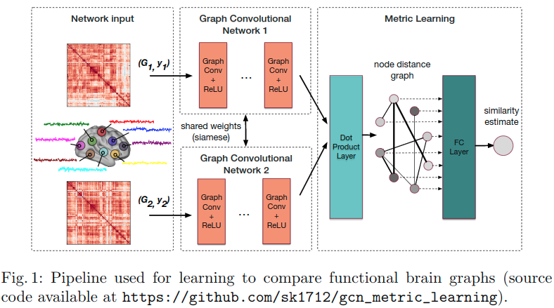

## Anomaly Detection Report

**贡献：**

- 基于VRNN在图的时间序列上的异常检测(the anomaly detection problem on graph time series)
- 用RNN和VI结合，对时间相关性建模；用GCN对空间信息建模
- 为了引入其他外部因素，用了特征提取器做特征提取，以学习到外部因素的影响
- 由于这个model用的目标函数是`accumulative ELBO`，可以容易地将model拓展为on-line方法。此在交通流数据上的实验证明了该方法的检测能力

**问题：**

现有的工作只学习了时间间隔h的graph behavior，对长、复杂和重复的patterns效果并不好。

**解决办法：**

结合variation inference(VI)和RNN对图上的时间序列建模，并且用log likelihood检测异常。时间序列模型是基于VRNN的(variational RNN)。而在空间数据上，用的GCNN处理图数据。

**总结：**

本文展示了`variational inference and recurrent neural networks`在时间序列异常检测的应用。在对比试验中证明了模型在图的时间序列上的异常检测中效果不错，`spectral filter`可以更好的学习空间信息，`variational inference and recurrent neural networks`对时间相关性进行建模。`multi-variable Gaussian model `对异常值足够敏感。与之前工作不同的是，我们的模型不仅可以检测异常时间点，还可以定位图上的异常节点。未来计划将该模型用于视频异常检测。

---

## COVARIANT COMPOSITIONAL NETWORKS FOR LEARNING GRAPHS

大多数现有的用于学习图的神经网络通过消息传递方案来解决置换不变性，其中每个节点将来自其邻居的特征向量相加。我们认为这强加了它们的表示能力的限制，而是提出了一种用于表示由分层结构组成的对象的新的通用体系结构，我们称之为covariant compositional networks(CCNs)。在这里，covariant意味着每个神经元的特征向量必须在permutation(排列，交换)后以特定的方式进行转换，类似于CNNs中的steerability(Here, covariance means that the activationof each neuron must transform in a specific way under permutations, similarly tosteerability in CNNs)。我们根据permutation group的张量表示，进行activation transform，来实现协方差，并且导出每个神经元必须实现的相应张量聚集规则。实验表明，CCNs可以超越标准的graph learning基准。

如CNNs此类以信息传递为重点的网络称之为message passing neural networks(MPNNs)，它们仅仅将邻接节点的信息求和，是一个严重的局限。所以我们提出了一个新的神经网络结构，叫compositional networks(comp-nets)。其中之一的好处是，与其关注信息如何在节点间传播，它强调的是convolutional network的连接。特别是，它表明MPNNs缺少的实质上是类似steerability的东西。

Steerability意味着在给定的神经元上的activations(特征向量)必须根据视野域的特定表达来转换。在本文中我们只考虑定义其表示形式和其张量积。

发现网络中每个通道对应于一种将高阶张量收缩到低阶张量的方式。注意到在这里通过张量激活我们的意思不仅仅是每个激活被表示为多维数字阵列（因为这个词通常用于神经网络文献中），而且还表示它在排列下以特定方式转换，这是一种
更严格的标准。
我们协变组合的参数是混合矩阵的条目，规定了这些通道在每个节点处如何相互通信。

我们的实验表明，这种新架构可以在几个标准数据集上击败标量消息传递神经网络。

---

## Distance Metric Learning using GraphConvolutional Networks: Application to Functional Brain Networks

- 2017
- 与GCN有关

**贡献：**

- 将siamese graph convolutional neural network应用于不规则graph，并使用了polynomial filters
- 应用了全局loss function
- 能够学习更好的关于图的潜在表达

**总结：**

- 提出了一种新的度量学习方法评估graph之间的距离，同时借助谱图理论将此方法应用在不规则graph上
- 在Abide数据集上的实验结果表明，我们的方法可以学习针对临床应用量身定制的graph的相似性度量，与传统的距离度量相比，简单分类器的性能提高了11.9％。据我们所知，这个GCN在度量学习上的首次应用。

source code available at https://github.com/sk1712/gcn_metric_learning

---

## Local Spectral Graph Convolution for Point Set Feature Learning

- 2018
- 与GCN有关

**问题：**

在point clouds上的特征学习引入了如point-net++的深度学习框架，很有前景。但是到目前为止，仅利用了point的特征，忽略了与邻接点的连接及邻接点的特征。

**解决办法：**

用spectral graph convolution和新的图池化策略克服了这个困难。我们用递归聚类和池化策略取代了max pooling，该策略在spectral coordinates中判断节点相似性，并且聚类，然后汇总clusters里面的节点的信息，从而得到更好的特征表达。

**贡献：**

- 使用了spectral graph convolution
- 可在运行期间动态构建图，并即时计算Laplacian和pooling hierarchy
- 使用一种新颖而有效的图池化策略，该策略在spectral coordinates中判断节点相似性，并且聚类，然后汇总clusters里面的节点的信息

**总结：**

简单来说，就是先对point cloud聚类，然后做多次pooling，最后的结果可以用于分割或者分类

---

## Matching Long Text Documentsvia Graph Convolutional Networks

- 2018
- 与GCN有关

我们提出了一个图方法做文本匹配，例如识别两篇新闻报道是否报道同一个事件。此方法叫Concept Interaction Graph，它能够产生文档的图表达。在图表达中，每个顶点表示不同的概念，是由代表文档中一个或者一组文档中的关键词；边代表概念之间的相互作用，根据文档中的句子连接起来。基于一对文档的图表达，我们提出了Siamese Encoded Graph Convolutional Network。我们用Siamese Encoded Graph Convolutional Network学习顶点的表达，并利用GCN聚集节点特征，从而得到匹配结果。基于腾讯为其智能新闻产品创建的两个标签新闻文章数据集，对所提出的方法进行了广泛的评估，结果表明，我们的方法对于长文档匹配的性能明显优于各种最先进的方法。

**总结：**

一种用GCN做文本匹配的方法，其主要贡献在应用方面，即如何将文本转化为图，放入GCN，最后将得到的处理结果与其他从文档中手动提取的特征用于回归任务。

---

## MOTIFNET: A MOTIF-BASED GRAPH CONVOLUTIONAL NETWORKFOR DIRECTED GRAPHS

- 2018
- 与GCN有关

**问题：**

spectral CNNs的一个关键的缺点是他们对无向图明确的假设，导致导致具有正交特征分解(orthogonal eigendecom-position)的对称拉普拉斯矩阵。

**解决办法：**

提出了MotifNet，一个能利用local graph motifs处理有向图的graph CNN。我们使用了一种注意力机制，使得MotifNet一般化标准的graph CNN，并且不会显著地增加模型复杂度。

---

## NETWORK EMBEDDING  USING HIERARCHICAL FEA-TURE AGGREGATION

- 2018
- 与GCN有关

 GCN及其变种不能有效地获取距离节点有一定深度的节点信息，于是我们提出了一种新的层次特征聚合方法，它使用LSTM获取邻接点的不同深度的信息。与最先进的方法相比，所提出的模型在四个真实世界的数据集上有了不错的结果。

**问题：**

GCN, GraphSAGE(and their variants)有两个主要局限：

1. 不能高效获取超过第二跳的节点信息。GCN超过两跳需要多于指数倍的计算能力，在许多现实数据上实际上不可行。Graph SAGE考虑了抽样后的邻接点，但是并没有在超过两跳的深度上有更多的提高。
2. GraphSAGE和GCN都是迭代地将邻接节点的信息传递到节点上，即更深的信息通过较低深度的节点传播。因此，更深的邻接节点在将信息传递到当前节点前会被多次平均化，引起信息的变化。

**贡献：**

我们提出了hierarchical feature aggregation approach，它会在不同深度的邻域上学习不同的特征聚合器。然后使用LSTM聚合不同深度的信息，从而确保信息从更高的深度流向节点。

---

## Neural Graph Machines: Learning Neural Networks Using Graphs

- 2017
- 与GCN有关

Label propagation是一种在图上的功能强大且灵活的半监督学习方法。而神经网络被证明在许多监督学习中有track records。在本文中，我们提出了一个带有graph-regularised objective的框架，叫Neural Graph Machines。它结合了神经网络和label propagation的功能。本文概括了之前有关神经网络的图增强学习文献，使其能够用于多种神经网络(NN, CNN, LSTM, RNN)以及各种各样的图。新的objective通过以下方法使得神经网络可以使用有label和没有label的数据：

- 允许网络像监督学习一样使用标记数据进行训练
- 与label propagation一样，偏移神经网络去学习图上邻接节点的相似的隐藏表达

这种体系结构可以用SGD高效训练，并且可以对大图进行缩放。其运行时间与边的数量线性相关。所提出的联合训练方法在各种各样的任务上优于许多现有方法，并且其图的输入形式是多种的(有节点特征或者没有节点特征的图)，并且可以使用不同的神经网络。

**总结**：

- Graph-augmented neural network可以用于许多神经网络；另外，这种技术可以用于inductive and transductive setting(归纳直推)；有助于其他神经网络在label很少的数据中训练
- 该框架可以处理多种形式的graph，无论是自然给定还是基于嵌入和知识库构建。
- 在这个联合训练框架中单独使用graphs信息和邻域信息作为神经网络的直接输入可以进行快速简单的推理。而当前最先进的方法是采用两步法，先得到节点的嵌入表达，然后用得到的feature另外训练分类器。
- 我们提出的框架提供了一种简单的技术去找到能够提供更好的性能的更小更快的神经网络。

---

# 总结

**Anomaly Detection Report**

- 与GCN有关

做时间序列上的异常检测结合variation inference(VI)和RNN对图上的时间序列建模，并且用log likelihood检测异常。时间序列模型是基于VRNN的(variational RNN)。而在空间数据上，用的GCNN处理图数据。

**COVARIANT COMPOSITIONAL NETWORKS FOR LEARNING GRAPHS**

- 与GCN有关

所以我们提出了一个新的神经网络结构，叫compositional networks(comp-nets)。其中之一的好处是，与其关注信息如何在节点间传播，它强调的是convolutional network的连接。特别是，它表明MPNNs缺少的实质上是类似steerability的东西

**Distance Metric Learning using GraphConvolutional Networks: Application to Functional Brain Networks**

- 与GCN有关

提出了一种新的度量学习方法评估两个graph之间的距离

**Local Spectral Graph Convolution for Point Set Feature Learning**

- 与GCN有关

对point cloud做分类，用递归聚类和池化策略取代了max pooling，该策略在spectral coordinates中判断节点相似性，并且聚类，然后汇总clusters里面的节点的信息，从而得到更好的特征表达。

**Matching Long Text Documentsvia Graph Convolutional Networks**

- 与GCN有关

提出一种用GCN做文本匹配的方法，其主要贡献在应用方面，即如何将文本转化为图，放入GCN，最后将得到的处理结果与其他从文档中手动提取的特征用于回归任务。

**MOTIFNET: A MOTIF-BASED GRAPH CONVOLUTIONAL NETWORKFOR DIRECTED GRAPHS**

- 与GCN有关

提出了MotifNet，一个能利用local graph motifs处理有向图的graph CNN。我们使用了一种注意力机制，使得MotifNet一般化标准的graph CNN，并且不会显著地增加模型复杂度。

**NETWORK EMBEDDING  USING HIERARCHICAL FEA-TURE AGGREGATION**

- 与GCN有关

我们提出了hierarchical feature aggregation approach，它会在不同深度的邻域上学习不同的特征聚合器。然后使用LSTM聚合不同深度的信息，从而确保信息准确地从更高的深度流向节点。

**Neural Graph Machines: Learning Neural Networks Using Graphs**

- 与GCN有关

提出了一个带有graph-regularised objective的框架，叫Neural Graph Machines，它结合了神经网络和label propagation的功能。
