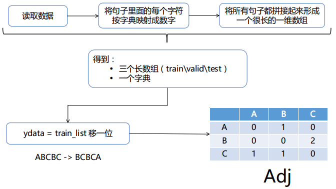

# GCRN代码解读

* 论文及源代码：[点击这里](https://github.com/youngjoo-epfl/gconvRNN)

若有错误，欢迎指正。

GCN，是基于Spectral Graph Theory所研究出来的一种方法，它主要的好处是利用了SGT里面一些已有的结论和方法，来得到图的性质。GCRN是一个将GCN和RNN结合起来使用的模型，能处理具有空间和时序的数据。

源代码的目录结构：

```
gconvRNN
  - datasets
    - ptb.char.test.txt
    - ptb.char.train.txt
    - ptb.char.valid.txt
  - gcrn_main.py  # 整个程序的入口
  - config.py  # 用于配置超参数
  - graph.py  # 与图相关的操作，比如laplacian矩阵
  - model.py  # 模型的定义
  - trainer.py  # 定义了训练过程
  - utils.py  # 数据预处理、工具
```

在源码中，GCRN用于预测单词字符序列

本文从三个方面讲解GCRN源码的处理思路

* 数据预处理
* GCRN实现思路
* 开始训练
* 代码附录

### 数据预处理：

*train\valid\test 数据集的格式都是一样的：*

>a e r _ b a n k n o t e _ b e r l i t z _ c a l l o w a y _ c e n t r u s t _ c l u e t t _ f r o m s t e i n _ g i t a n o _ g u t e r m a n _ h y d r o - q u e b e c _ i p o _ k i a _ m e m o t e c _ m l x _ n a h b _ p u n t s _ r a k e _ r e g a t t a _ r u b e n s _ s i m _ s n a c k - f o o d _ s s a n g y o n g _ s w a p o _ w a c h t e r <br>
 p i e r r e _ < u n k > _ N _ y e a r s _ o l d _ w i l l _ j o i n _ t h e _ b o a r d _ a s _ a _ n o n e x e c u t i v e _ d i r e c t o r _ n o v . _ N <br>
 m r . _ < u n k > _ i s _ c h a i r m a n _ o f _ < u n k > _ n . v . _ t h e _ d u t c h _ p u b l i s h i n g _ g r o u p

* ```UNK``` - "unknown token" - is used to replace the rare words that did not fit in your vocabulary. So your sentence ```My name is guotong1998``` will be translated into ```My name is _unk_```

**1. 将句子按字典映射成数字序列**

```
for every sentences:
  在句子后面加“|”（人为地添加句子的结束标识符）
  将句子里面的*每个字符*映射成该字符在字典中*对应的数字*
```

例如：

p i e r r e _ < u n k > _ N _ y e a r s _ o l d _ w i l l _ j o i n _ t h e _ b o a r d _ a s _ a _ n o n e x e c u t i v e _ d i r e c t o r _ n o v . _ N |

[24, 10, 1, 2, 2, 1, 3, 27, 15, 5, 6, 28, 3, 29, 3, 14, 1, 0, 2, 16, 3, 7, 9, 21, 3, 13, 10, 9, 9, 3, 30, 7, 10, 5, 3, 8, 20, 1, 3, 4, 7, 0, 2, 21, 3, 0, 16, 3, 0, 3, 5, 7, 5, 1, 25, 1, 12, 15, 8, 10, 31, 1, 3, 21, 10, 2, 1, 12, 8, 7, 2, 3, 5, 7, 31, 32, 3, 29, 26]


**2. 构造邻接矩阵**



得到邻接矩阵的值：


### GCRN实现思路：

GCRN = GCN + RNN。

*公式*：


**但是** 代码中的实现方式稍有不同

**GCN** ：

$$L = adj/adj.max$$

$$Laplacian = \frac{2L}{lmax} - I$$

$$T_k(x) = 2LT_{k-1}(x)-T_{k-2}(x)$$

每次得到的 $T_k(x)$ 都与x做concat，最后得到的x与W相乘

**LSTM** ：


### 开始训练

数据预处理 -> model定义 -> train


输出```ouput```的shape为(batch_size, num_node, num_unit) —— (20, 50, 50)。由于设置了有50个LSTM units，所以这里需要使所有units的输出做线性变换，使其变为一个值：

* ```prediction = output * W -b```，这里的```prediction```的shape为(20, 50, 1)

那么，所有时刻的输出的shape为(50, 20, 50, 1)

### 代码

**GCN实现方法**

```python
def cheby_conv(x, L, lmax, feat_out, K, W):
    '''
    x : [batch_size, N_node, feat_in] - input of each time step
    nSample : number of samples = batch_size
    nNode : number of node in graph
    feat_in : number of input feature
    feat_out : number of output feature
    L : laplacian
    lmax : ?
    K : size of kernel(number of cheby coefficients)
    W : cheby_conv weight [K * feat_in, feat_out]
    '''
    nSample, nNode, feat_in = x.get_shape()
    nSample, nNode, feat_in = int(nSample), int(nNode), int(feat_in)
    L = graph.rescale_L(L, lmax) #What is this operation?? --> rescale Laplacian
    L = L.tocoo()

    indices = np.column_stack((L.row, L.col))
    L = tf.SparseTensor(indices, L.data, L.shape)
    L = tf.sparse_reorder(L)

    x0 = tf.transpose(x, perm=[1, 2, 0]) #change it to [nNode, feat_in, nSample]
    x0 = tf.reshape(x0, [nNode, feat_in*nSample])
    x = tf.expand_dims(x0, 0) # make it [1, nNode, feat_in*nSample]

    def concat(x, x_):
        x_ = tf.expand_dims(x_, 0)
        return tf.concat([x, x_], axis=0)

    if K > 1:
        x1 = tf.sparse_tensor_dense_matmul(L, x0)
        x = concat(x, x1)

    for k in range(2, K):
        x2 = 2 * tf.sparse_tensor_dense_matmul(L, x1) - x0
        x = concat(x, x2)
        x0, x1 = x1, x2

    x = tf.reshape(x, [K, nNode, feat_in, nSample])
    x = tf.transpose(x, perm=[3,1,2,0])
    x = tf.reshape(x, [nSample*nNode, feat_in*K])

    x = tf.matmul(x, W) #No Bias term?? -> Yes
    out = tf.reshape(x, [nSample, nNode, feat_out])
    return out
```

**LSTM实现方法**

```python
def __call__(self, inputs, state, scope=None):
    with tf.variable_scope(scope or type(self).__name__):
        if self._state_is_tuple:
            c, h = state
        else:
            c, h = tf.split(value=state, num_or_size_splits=2, axis=1)
        laplacian = self._laplacian
        lmax = self._lmax
        K = self._K
        feat_in = self._feat_in

        #The inputs : [batch_size, nNode, feat_in, nTime?] size tensor
        if feat_in is None:
            #Take out the shape of input
            batch_size, nNode, feat_in = inputs.get_shape()
            print("hey!")

        feat_out = self._num_units

        if K is None:
            K = 2

        scope = tf.get_variable_scope()
        with tf.variable_scope(scope) as scope:
            try:
                #Need four diff Wconv weight + for Hidden weight
                Wzxt = tf.get_variable("Wzxt", [K*feat_in, feat_out], dtype=tf.float32,
                                       initializer=tf.random_uniform_initializer(minval=-0.1, maxval=0.1))
                Wixt = tf.get_variable("Wixt", [K*feat_in, feat_out], dtype=tf.float32,
                                       initializer=tf.random_uniform_initializer(minval=-0.1, maxval=0.1))
                Wfxt = tf.get_variable("Wfxt", [K*feat_in, feat_out], dtype=tf.float32,
                                       initializer=tf.random_uniform_initializer(minval=-0.1, maxval=0.1))
                Woxt = tf.get_variable("Woxt", [K*feat_in, feat_out], dtype=tf.float32,
                                       initializer=tf.random_uniform_initializer(minval=-0.1, maxval=0.1))

                Wzht = tf.get_variable("Wzht", [K*feat_out, feat_out], dtype=tf.float32,
                                       initializer=tf.random_uniform_initializer(minval=-0.1, maxval=0.1))
                Wiht = tf.get_variable("Wiht", [K*feat_out, feat_out], dtype=tf.float32,
                                       initializer=tf.random_uniform_initializer(minval=-0.1, maxval=0.1))
                Wfht = tf.get_variable("Wfht", [K*feat_out, feat_out], dtype=tf.float32,
                                       initializer=tf.random_uniform_initializer(minval=-0.1, maxval=0.1))
                Woht = tf.get_variable("Woht", [K*feat_out, feat_out], dtype=tf.float32,
                                       initializer=tf.random_uniform_initializer(minval=-0.1, maxval=0.1))
            except ValueError:
                scope.reuse_variables()
                Wzxt = tf.get_variable("Wzxt", [K*feat_in, feat_out], dtype=tf.float32,
                                       initializer=tf.random_uniform_initializer(minval=-0.1, maxval=0.1))
                Wixt = tf.get_variable("Wixt", [K*feat_in, feat_out], dtype=tf.float32,
                                       initializer=tf.random_uniform_initializer(minval=-0.1, maxval=0.1))
                Wfxt = tf.get_variable("Wfxt", [K*feat_in, feat_out], dtype=tf.float32,
                                       initializer=tf.random_uniform_initializer(minval=-0.1, maxval=0.1))
                Woxt = tf.get_variable("Woxt", [K*feat_in, feat_out], dtype=tf.float32,
                                       initializer=tf.random_uniform_initializer(minval=-0.1, maxval=0.1))

                Wzht = tf.get_variable("Wzht", [K*feat_out, feat_out], dtype=tf.float32,
                                       initializer=tf.random_uniform_initializer(minval=-0.1, maxval=0.1))
                Wiht = tf.get_variable("Wiht", [K*feat_out, feat_out], dtype=tf.float32,
                                       initializer=tf.random_uniform_initializer(minval=-0.1, maxval=0.1))
                Wfht = tf.get_variable("Wfht", [K*feat_out, feat_out], dtype=tf.float32,
                                       initializer=tf.random_uniform_initializer(minval=-0.1, maxval=0.1))
                Woht = tf.get_variable("Woht", [K*feat_out, feat_out], dtype=tf.float32,
                                       initializer=tf.random_uniform_initializer(minval=-0.1, maxval=0.1))


            bzt = tf.get_variable("bzt", [feat_out])
            bit = tf.get_variable("bit", [feat_out])
            bft = tf.get_variable("bft", [feat_out])
            bot = tf.get_variable("bot", [feat_out])

            # gconv Calculation
            zxt = cheby_conv(inputs, laplacian, lmax, feat_out, K, Wzxt)
            zht = cheby_conv(h, laplacian, lmax, feat_out, K, Wzht)
            zt  = zxt + zht + bzt
            zt  = tf.tanh(zt)

            ixt = cheby_conv(inputs, laplacian, lmax, feat_out, K, Wixt)
            iht = cheby_conv(h, laplacian, lmax, feat_out, K, Wiht)
            it  = ixt + iht + bit
            it  = tf.sigmoid(it)

            fxt = cheby_conv(inputs, laplacian, lmax, feat_out, K, Wfxt)
            fht = cheby_conv(h, laplacian, lmax, feat_out, K, Wfht)
            ft  = fxt + fht + bft
            ft  = tf.sigmoid(ft)

            oxt = cheby_conv(inputs, laplacian, lmax, feat_out, K, Woxt)
            oht = cheby_conv(h, laplacian, lmax, feat_out, K, Woht)
            ot  = oxt + oht + bot
            ot  = tf.sigmoid(ot)

            # c
            new_c = ft*c + it*zt

            # h
            new_h = ot*tf.tanh(new_c)

            if self._state_is_tuple:
                new_state = LSTMStateTuple(new_c, new_h)
            else:
                new_state = tf.concat([new_c, new_h], 1)
            return new_h, new_state
```


##### 其他变量

| 变量 | shape | meaning |
| ------- | ---------------- | ------------------------------------------------ |
| rnn_input | (20, 50, 1, 50) | (batch_size, num_node, feat_in, num_time_steps) |
| rnn_input_seq | (20, 50, 1) * 50 | (batch_size, num_node, feat_in) * num_time_steps |
| rnn_output | (20, 50) | (batch_size, num_time_steps) |
| rnn_output_seq | (20) * 50 | (batch_size) * num_time_steps |
| num_hidden | 50 | 隐藏层单元 |
| x_batches | (5017, 20, 50) | [-1, batch_size, seq_length] |
| y_batches | (5017, 20, 50) | [-1, batch_size, seq_length] |
| outputs | (50, 20, 50, 50) | (50个时刻50个输出, batch_size, num_node, num_unit) |
| output | (20, 50, 50) | outputs的单个时刻输出(batch_size, num_node, num_unit) |


### Laplacian matrix


**Properties**

对一个无向图$G$和他的laplacian matrix $L$，有特征值$\lambda_0 \leq \lambda_1 \leq \lambda_2 ...$：

* L是对称的
* L是半正定的（即所有$\lambda_i > 0$），这可以在关联矩阵部分验证，也同样可以从Laplacian是对称并且对角占优(diagonally dominant)得出
* L是M-matrix（它的非对角线上的项是负的，但它的特征值的实部为负）
* 行或列相加结果为0
* L的最小非零特征值称为谱间隙（spectral gap）
* 图中连通分量的个数是拉普拉斯算子的零空间维数和0特征值的代数多重性
* 拉普拉斯矩阵是奇异的


### 问题

1. 代码实现里面的公式跟论文是否真的不一样
2. x2 = 2 * tf.sparse_tensor_dense_matmul(L, x1) - x0 起到一个什么作用
