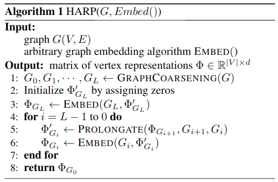
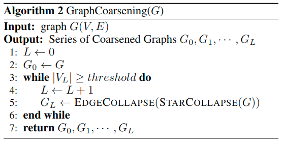
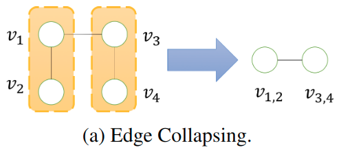
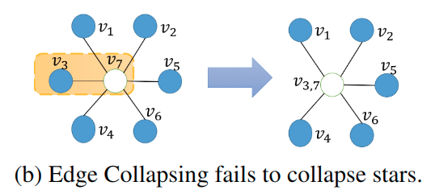
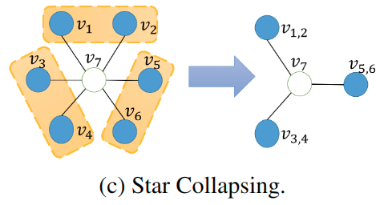

## Introduction

- 论文题目：
HARP: Hierarchical Representation Learning for Networks

相关方法

- DeepWalk：graph representation learning
- LINE
- Node2vec

问题

- local approache
- non-convex optimization goal solved using SGD

HARP

- 通过合并节点和边，得到一系列结构相似的小图
-

前提

- 每一个小图都有明显的全局结构，例如环、平面。

## Problem Formulation

对$G = (V, E)$，一般的是这样做的

$$\Phi:V \mapsto R^{|V| × d}, d \ll |V|$$

这存在两个问题

- higher-order graph structural information is  notmodeled
- their stochastic optimization can fall victim to poor initialization

所以本文要找到$G_s$，使得

$$G_s = (V_s, E_s), (|V_s| \ll |V|, |E_s| \ll |E|)$$

这样做可以更好地embeding，两个原因

- 更多的成对的关系。目标方程更平滑，因此更容易优化。
- 在更小的图上，由于浓缩了整个图，所以对local应用算法就已经包含了图的一定的全局结构

## Method

### HARP

1. Graph Coarsening (*line 1*)：能得到越来越小的图$G_0, G_1,...,G_L$，其中$G_0=G$。作者称这一系列$G_i$为*hierarchy*。
2. Graph Embedding on Coarsest Graph($G_L$) (*line 2-3*)。因为$G_L$小得多，容易得到图的高质量表达。
3. Graph Representation Prolongation and Refinement (*line 4-7*)
4. Graph Embedding of the Original Graph (*line 8*)

### Graph Coarsening

有两个关键点

- edge collapsing
- star collapsing

这两个关键点**分别**保留了first-order proximity和second-order proximity

- first-order proximity：两个顶点之间的边的权重。如果两顶点间没有边相连，则first-order proximity为0。
- second-order proximity：根据两个节点的邻接点衡量相似性。各自的邻接点越相似，那么该两个节点的结构越相似，second-order proximity越大。若两个节点都没有顶点与其相连，则两个顶点间的second-order proximity为0

### Edge Collapsing

将两个相连的点合并成一个点，合并次序是任意的。因此这个方法保留了first-order proximity

### Star Collapsing

对于星型结构，如果用edge collapsing的方法的话，需要$O(k)$步而不是$O(log\ k)$

相对的我们可以观测到，中心点的所有邻接点共享一个中心点，这意味着他们的second-order proximity比较高，所以可以考虑将邻接点合并。这个做法快得多。

### Hybrid Coarsening Scheme

一直做coarsening直到图足够小

### Embedding Prolongation

结合$G_{i+1}$来初始化$G_i$。作者观察到

- $v \in G_{i+1}$
