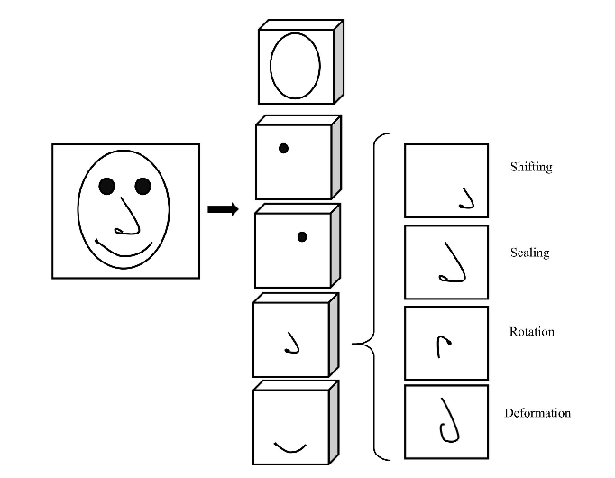
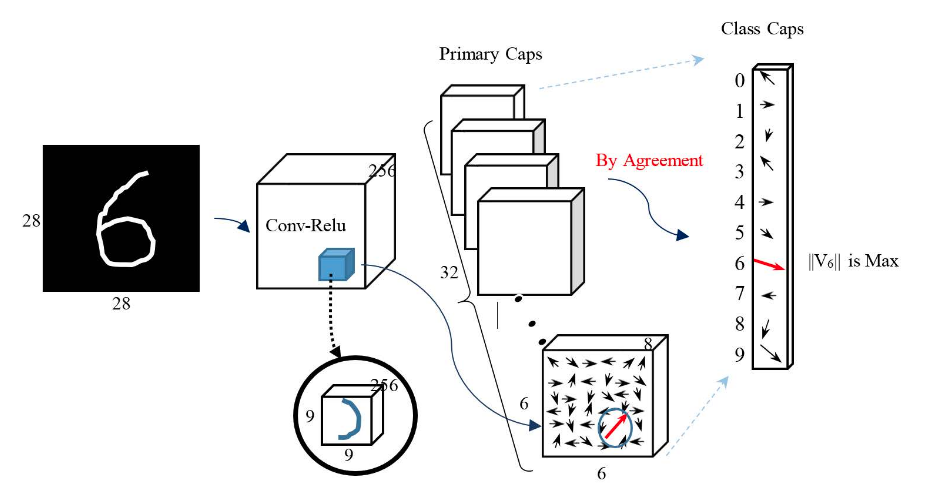
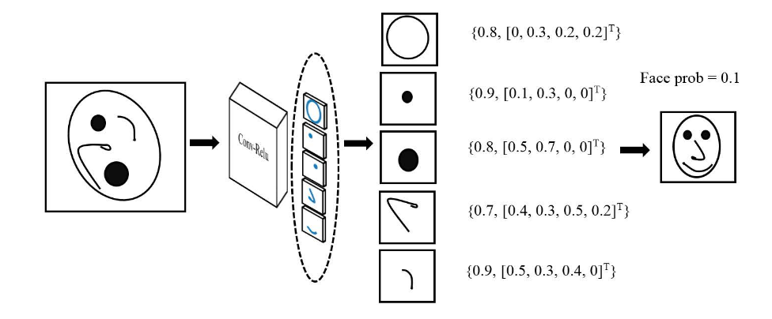
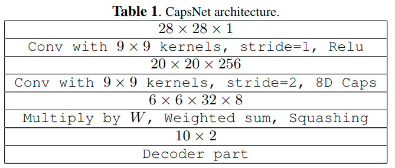
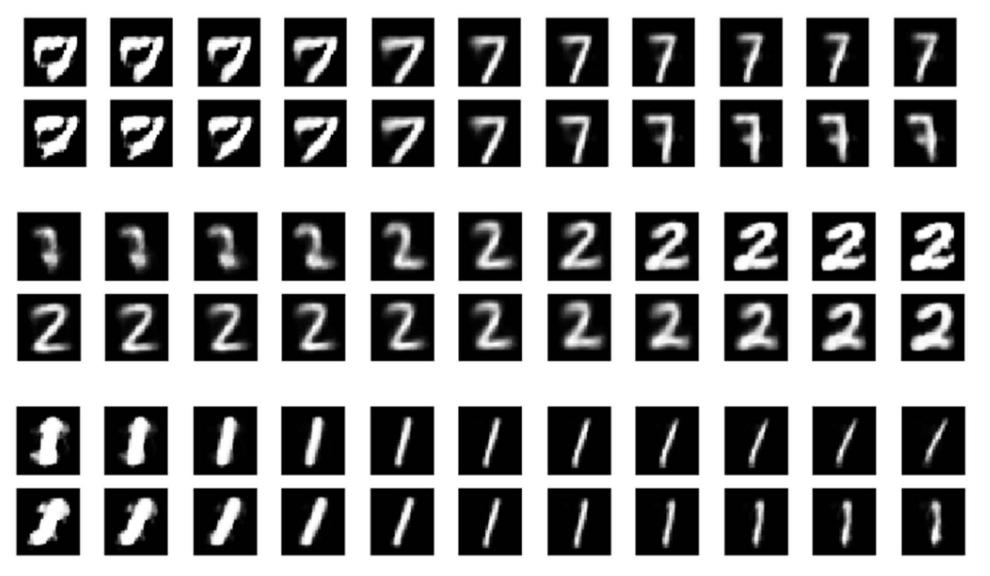
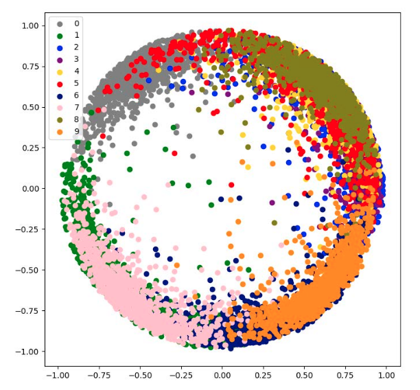
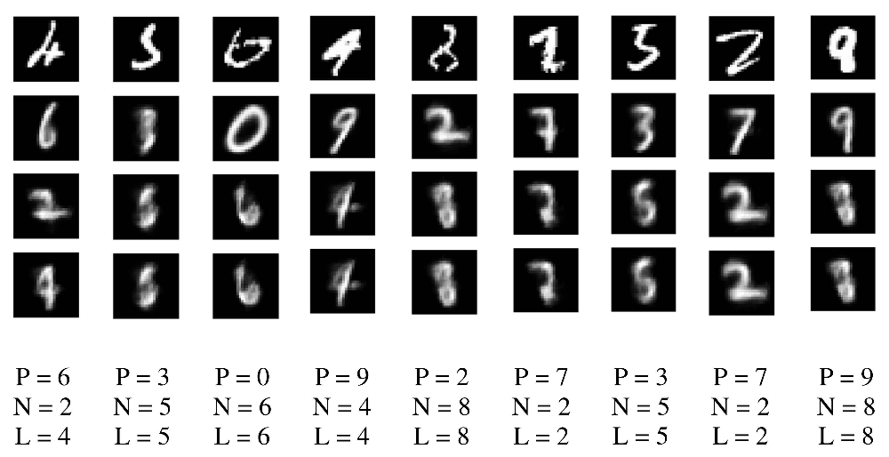

# IMPROVED EXPLAINABILITY OF CAPSULE NETWORKS: RELEVANCE PATH BY AGREEMENT

**问题**

现今的深度学习模型可解释性不强。

**贡献**

最近提出的CapsNets具备可解释性，所以本文我们会研究CapsNets的结构和行为，说明这种网络的潜在可解释性。

## Capsules Problem Formulation

**CNNs存在的问题**

- 一般来说，我们是通过多层CNNs来逐步提取更为抽象的特征。但是CNN忽略了层内的层级结构（人脑里面就有这样的结构）
- CNNs使用了池化，会丢失一些高层特征之间的精确的空间关系
- >he other problem is that CNNs are not robust against new view points, because they can not extrapolate their geometric information.

因为这些原因，CapsNet提出使用等价性代替不变性，这意味着如果输入是以被空间转换的，那么网络会自适应并且恰当地回应。

实际上，引入capsule是为了将各种信息（例如颜色、纹理、位置、方向等）封装成一个对象。这种结构的“深”并不在层数很多，而是一层有很多capsule，所以宽度很“深”。它可以被看做是parse tree，因为每个active capsule会选择下一层的某个capsule作为它的父capsule。因此，CapsNets可以更好地处理不同的视觉刺激；并且相对于CNNs使用pooling来说，CapsNets可以提供更好的平移不变性。

>Fig. 2. Examples of instantiation parameters for a nose capsule inface detection problem.

Fig.2展示了一个CapsNets用于鼻子检测的问题。在这个例子中，有5个代表面部组件的capsule，和4个实例化参数（即移位，缩放，旋转和变形）。这些参数由网络自动提取。

值得一提的是，再设计CapsNets的架构时，我们只规定了capsule的数量和每个capsule的实例化参数的数量（也就是每个capsule的维度），然后网络就可以自动学习具体的数据。

>Fig. 3.Detection architecture for a three  layers CapsNet. Each arrow in the Primary-Caps layer indicates activity vector of a capsule. The red arrow shows an activated capsule  with  higher magnitude for the example kernel introduced to find right curve fragment of digit6.

Fig.3所示的网络结构分为三层

- 卷积层
- Primary Capsule（PC）层
- Class-Capsule（CC）层

可以看到，在PC层，每个capsule是8维的，每一维都代表这不同类型的信息。此外，PC层由32个component capsule组成，每个component capsule由36个capsule组成（如Fig.3中PC层的箭头所示）。因此，在这个例子中共有$N_1 = 36 \times 32 = 1152$个capsule。

CC层共10个capsule，维度为2。

最后，在Fig.3所示的例子中，CC层的capsule $v_6$ 的长度最大，因此该图片被判断为数字6。

## 3 Capsules' Explainability

### 3.1 Relevance Path by Agreement

CapsNets的可解释性是由它的向量表示带来的。

PC层某capsule $u_i$的模长可以被解释为该capsule已被训练检测的特征存在的概率。更具体来说，我们可以为每个capsule分配一组由两部分组成的集合来说明：

- 该capsule所检测的特征存在的概率
- 实例化参数矢量值可以用于说明各层之间的一致性。换句话说，当某个对象所有capsule都训练好时，这个对象的对应的高层capsule会有更高的可能性。这可以解释网络为什么检测到对象。

>Fig. 4.Mismatch among instantiation parameter vectors for the face capsule. The first element of each set is the likelihood (probability) of that PC and the second element is the capsule’s prediction vector. Although, all the facial components exist with high probability, they disagreement among them explains the resulting low probability for the face capsule.

Fig.4展示了代表着五官的5个component capsule，可以看到它们检测到了脸部的五官（概率很高），但是由于最后一层的面孔capsule的概率较低，所以网络将这张图片判定为不是脸。（为什么能知道不是脸？）

## 4 Experimental Setup

Table 1.是论文实验中所使用的架构。除了最后一层是$10 × 2$（原论文用的是$10 × 16$）之外，其它都是一样的。至于为什么本论文要设置为2，猜测应该是为了实验方便（调整参数、可视化）

**论文的实验主要说明了几件事**：

*1. CapsNets学习出来的capsule具有可解释性*

>Fig. 5.Variation of two parameters output of the detected digit capsule within [0:25;0:25] with step size of 0.1 for three sample digits. One can then explain the learned features of the CCs as thickness and deformation.

如Fig.5所示，改变digit capsule的两个参数，然后重构为图像，可以发现数字的粗细和形状会发生改变。这个实验capsule的原论文也做了，本文的作者为了说明CapsNets学习到的capsule具有可解释性，再把实验做了一遍。

*2. 将第二大和第三大的likelihood作为第一大likelihood的替代方案*

>Fig.6. Two parameters output vector of detected digit capsules.

如Fig.6所示，不同digit capsule重叠了在一起。因此对于误分类的样本，很可能是误判为与真实数字重叠的数字了。通过对误分类的样本进行分析，发现除了一个误分类样本外，其它所有的误分类样本的真实类别的likelihood是第二大的，并且第三大的likelihood明显大于第四大的likelihood。

因此，可以将第二大和第三大的likelihood作为第一大likelihood的替代方案。

*3. 为何有误分类的样本*

>Fig. 7.Misclassified samples: The 1st row represents the input digit; The 2nd row shows the reconstructed digit by the CapsNet’s prediction; the 3rd row is the reconstruction based on the capsule with second highest likelihood, and; finally the last row is the reconstructed digit by true label.

Fig.7展示了在1000的样本中误分类的样本。第一行图片是原始的输入图片；第二行是根据CapsNets的预测结果重构的图片（第一大likelihood的capsule）；第三行是对第二大likelihood的capsule重构的图片；最后一行是用真实标签重构的图片。图片下面的三行数字对应着上面第二行到第四行的图片所表示的数字。

论文解释的意思是说，之说以误分类，是因为输入的图片很难分辨到底是什么数字。

## 5 Conclusion

在本文中，我们代表了深度神经网络中解释性的必要性，特别是在关键决策中，单个不正确的决定甚至是不可接受的。
以前的解释性方法通过添加额外的解释阶段来查找和可视化最相关的像素或神经元。
在这项工作中，我们通过分析胶囊网络的行为和结构，说明了胶囊网络的内在可解释性特征
