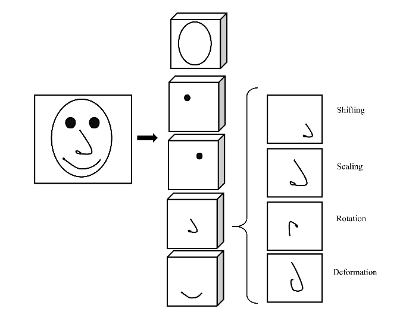
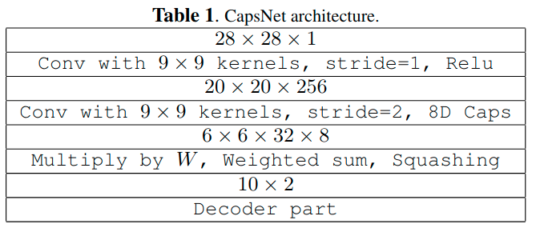
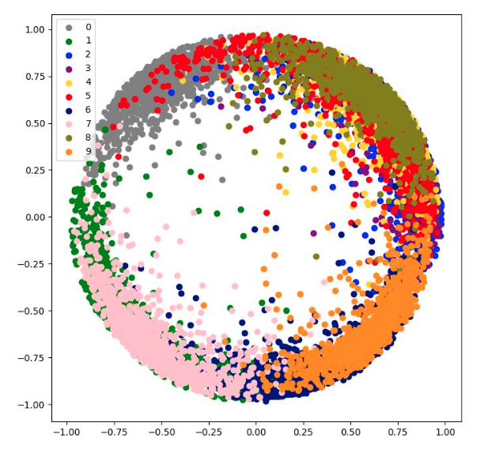
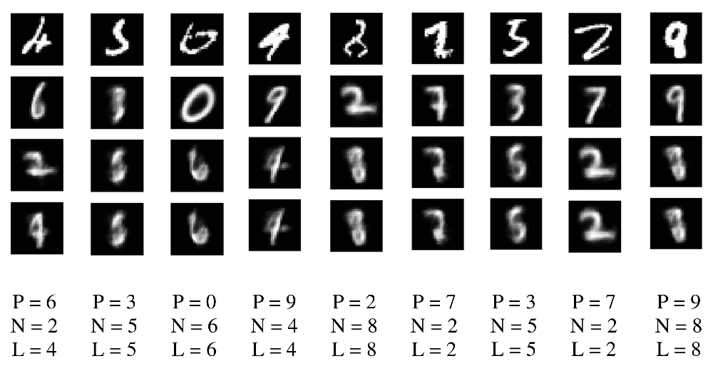

## IMPROVED EXPLAINABILITY OF CAPSULE NETWORKS: RELEVANCE PATH BY AGREEMENT

### 1 CNNs存在的问题

1. 一般来说，我们是通过多层CNNs来逐步提取更为抽象的特征。但是CNN忽略了层内的层级结构（人脑里面就有这样的结构，而在CapsNets中就是一层网络中有多个capsule）
2. CNNs使用了池化，会丢失一些高层特征之间的精确的空间关系
3. >The other problem is that CNNs are not robust against new view points, because they can not extrapolate their geometric information.

因为这些原因，CapsNet提出使用等变性代替不变性，这意味着如果输入是以被空间转换的，那么网络会自适应并且恰当地回应。

实际上，引入capsule是为了将各种信息（例如颜色、纹理、位置、方向等）封装成一个对象。这种结构的“深”并不在层数很多，而是一层有很多capsule，所以宽度很“深”。它可以被看做是parse tree，因为每个active capsule会选择下一层的某个capsule作为它的父capsule。因此，CapsNets可以更好地处理不同的视觉刺激；并且相对于CNNs使用pooling来说，CapsNets可以提供更好的平移不变性。

**关于等变性（Equivariance）和不变性（Invariance）**

如果一个函数满足，输入改变而输出也以同样的方式改变的这一性质，我们就说它是等变的（Equivariance）。例如下面这幅图，当目标出现在输入图片中的不同位置，输出的feature map应该是只是进行了平移变换。

而在毕加索的这幅画中，脸部五官都在，但是显然被解构和调整过。如果神经网络对目标的响应具有不变性（Invariance），显然仍然会认为这就是一张普通人脸。

### 2 CapsNets的可解释性

>Fig. 2. Examples of instantiation parameters for a nose capsule in face detection problem.

**CapsNets学习的实例化参数具有不同的作用**。例如在Fig.2中，有5个代表面部组件的capsule，和4个实例化参数（即移位，缩放，旋转和变形）。这些参数由网络自动提取。

>Fig. 4.Mismatch among instantiation parameter vectors for the face capsule. The first element of each set is the likelihood (probability) of that PC and the second element is the capsule’s prediction vector. Although, all the facial components exist with high probability, they disagreement among them explains the resulting low probability for the face capsule.

**CapsNets的可解释性是由它的向量表示带来的**。在CapsNets中有许多capsule，每个capsule都是一个向量，而capsule还可以组成为component capsule。到了component capsule这个层面，它可以作为对象的组件。CapsNets的一个优点是，不同的capsule可以通过学习检测到不同的特征，而CapsNets可以学习组合capsule的方式，进而完成分类任务。我们只需要规定capsule的数量和每个capsule的维度，网络就可以自动学习具体的数据。如Fig.4所示，有5个component capsule，它们分别检测到了脸部五官。

**CapsNets如何检测对象**

Capsule可以分两部分解释：

- capsule的模长表示该capsule所检测的特征存在的概率
- 实例化参数矢量值（instantiation parameter vector values）可以用于说明层与层之间的一致性。换句话说，如果所有与某个对象有关的capsule都被训练好了，那么这个对象对应的高层capsule的likelihood会更大。这可以解释网络为什么可以检测到对象。

Fig.4展示了代表着五官的5个component capsule，可以看到它们检测到了脸部的五官（概率很高），但是由于这几个component capsule之间的disagreement，导致最后一层的面孔capsule的概率较低，所以网络将这张图片判定为不是脸。

**Relevance Path by Agreement**

设Primary-Capsule（PC）层中的某个capsule为$u_i$，Class-Capsule（CC）层中的某个capsule为$v_j$，有$\hat{u}_{j|i}=W_{ij}u_i$，$W_{ij}$是通过反向传播学习的参数。该公式中的相乘操作可以看做$u_i$对$v_j$的投票。如果有一部分capsule都对$v_j$有着相似的投票，那么这意味着这些capsule对$v_j$ “agree to each other”。（这一段用通俗的话讲就是，$\hat{u}_{j|i}$是$u_i$对$v_j$的预测。若$\hat{u}_{j|i}$与$v_j$相似（agreement），那么$u_i$就会倾向于将信息传送给$v_j$。若多个capsule都与$v_j$相似，我们就称这些capsule“agree to each other”）

完整的公式如下：

$$v_j = squash(\sum_i softmax(b_{ij})W_{ij}u_i)$$

其中，$当前b_{ij} = 上一轮b_{ij} + \hat{u}_{j|i} \cdot v_j$

CapsNets还对每一层的输出向量用squashing函数压缩，使得向量的模长在0到1之间。该函数会使得模长小的向量变小甚至接近于0，模长大的向量保持其相对大小。因此，在迭代过程中，能够使得不相关的底层capsule $\hat{u}_{j|i}$变小，进而减少噪声。最后，通过迭代，CapsNets会训练出一个底层capsule与高层capsule连接的网络，这个网络就是根据agreement学习出来的信息传递的路径。

### 3 Experimental

Table 1.是论文实验中所使用的架构。除了最后一层是$10 × 2$（原论文用的是$10 × 16$）之外，其它都是一样的。至于为什么本论文要设置为2，猜测应该是为了实验方便（方便调整参数观察效果、对数据可视化）。

**论文的实验主要说明了几件事**：

*1. CapsNets学习出来的capsule具有可解释性*

>Fig. 5.Variation of two parameters output of the detected digit capsule within [0:25;0:25] with step size of 0.1 for three sample digits. One can then explain the learned features of the CCs as thickness and deformation.

如Fig.5所示，改变digit capsule的两个参数，然后重构为图像，可以发现数字的粗细和形状会发生改变。这个实验capsule的原论文也做了，本文的作者为了说明CapsNets学习到的capsule具有可解释性，再把实验做了一遍。

*2. 误分类样本的真实类别的likelihood是第二大的*

- 个人觉得这个实验并没有什么用，作者只是对最后一层的预测向量做了可视化，并且分析了误分类样本的输出向量，其分析结果也仅限与这个实验。

>Fig.6. Two parameters output vector of detected digit capsules.

最后一层digit capsule的每个capsule都是一个二维向量。取该层中模长最长的capsule，将其两个维度分别作为横纵坐标，做可视化，可以得到Fig.6。通过Fig.6可以看到，不同digit capsule重叠了在一起，例如1和7，6和9，3和5。因此作者认为，对于误分类的样本，很可能是误判为与真实数字重叠的数字了。

通过对误分类的样本的输出向量进行分析，发现除了一个误分类样本外，其它所有的误分类样本的输出向量中，真实类别对应的向量的likelihood是第二大的，并且第三大的likelihood明显大于第四大的likelihood。

因此，在决策的时候（如医学应用），可以将第二大和第三大的likelihood作为第一大likelihood的替代方案。（这是作者原话，个人也觉得这个结论在实践中没什么作用）

*3. 为何有误分类的样本*

>Fig. 7.Misclassified samples: The 1st row represents the input digit; The 2nd row shows the reconstructed digit by the CapsNet’s prediction; the 3rd row is the reconstruction based on the capsule with second highest likelihood, and; finally the last row is the reconstructed digit by true label.

Fig.7展示了在1000的样本中误分类的样本。第一行图片是原始的输入图片；第二行是根据CapsNets的预测结果重构的图片（第一大likelihood的capsule）；第三行是对第二大likelihood的capsule重构的图片；最后一行是用真实标签重构的图片。图片下面的三行数字对应着上面第二行到第四行的图片所表示的数字。

论文解释的意思是说，之说以误分类，是因为输入的图片很难分辨到底是什么数字。

## 4 Conclusion

在本文中，我们表明了深度神经网络中解释性的必要性，特别是在关键决策中，单个不正确的决定甚至是不可接受的。以前的解释性方法通过额外的解释方法来查找和可视化最相关的像素或神经元。在这项工作中，我们通过分析CapsNets的行为和结构，说明了CapsNets的内在可解释性。

---

## 总结

之前是希望capsule能做pooling，现在换个角度，从capsule的可解释性出发，模仿原论文的思路来做。

#### 下一步

**方案一**

GCN+CapsNets+CapsNets

首先由将每个节点作为一个capsule，通过第一层CapsNets（Cap1）分解为多个capsule，然后再将分解的结果放入第二层CapsNets（Cap2）进行组合。

**方案二**

对于每个节点，其当前特征作为一个capsule，其第一跳所有邻接点的特征转换为$N_1$个capsule，其第二跳所有邻接点的特征转换为$N_2$个capsule……

然后再用CapsNets进行组合。

**方案三**

先应用某算法，得到Laplacian matrix的特征值对应的不同表达，然后将这些不同的表达作为capsule应用CapsNets。

**目前先实现方案一，观察其在我们的数据上是否实现了分解组合的效果**。
