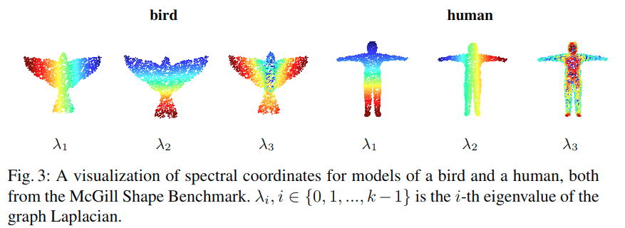
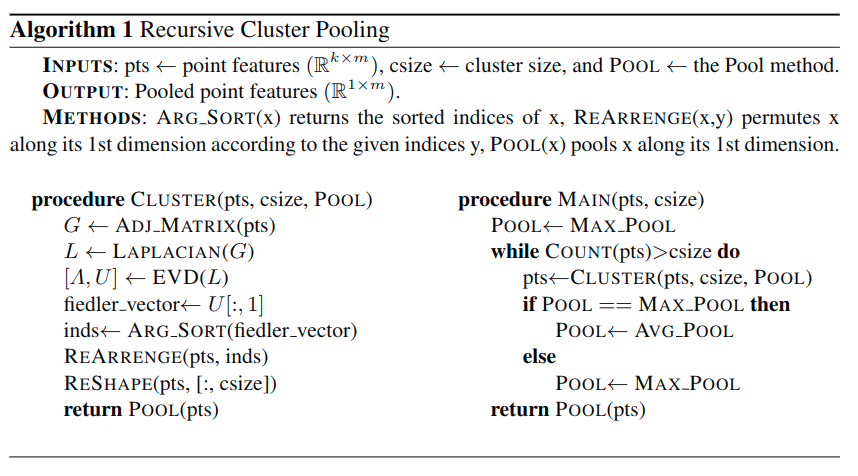

# Local Spectral Graph Convolution for Point Set FeatureLearning

## 什么是点云

点云数据是指在一个三维坐标系统中的一组向量的集合。这些向量通常以X,Y,Z三维坐标的形式表示，而且一般主要用来代表一个物体的外表面形状。

## 论文概览

**问题：**

在point clouds上的特征学习引入了如point-net++的深度学习框架，很有前景。但是到目前为止，仅利用了point的特征，忽略了与邻接点的连接及邻接点的特征。

**解决办法：**

用spectral graph convolution和新的图池化策略克服了这个困难。我们用递归聚类和池化策略取代了max pooling，该策略在spectral coordinates中判断节点相似性，并且聚类，然后汇总clusters里面的节点的信息，从而得到更好的特征表达。

**贡献：**

- 使用了spectral graph convolution
- 可在运行期间动态构建图，并即时计算Laplacian和分层次的池化
- 使用一种新颖而有效的图池化策略，该策略在spectral coordinates中判断节点相似性，并且聚类，然后汇总clusters里面的节点的信息

## 1 Introduction

pointnet++ framework表现出了对3D point clond做特征提取以用于识别和分割。这个框架是直接作用于点云数据，同时以分层方式聚集信息。为此，首先在输入点云上应用质心采样，然后进行通过半径搜索形成点邻域。点邻域被multi-layer perceptrons处理，然后对由此产生的结果通过池化提取特征。通过对点云的分层multi-layer learning，pointnet++在分割和分类任务中展示了不俗的性能。pointnet++是将输出视为无组织的点云的。

在这篇文章中，我们在pointnet++中采用了graph CNN和不同的池化策略，使得可以解决在点云上的深度学习方法的两个局限性：

1. 对每个点，特征学习并没有和其邻居的信息结合起来
2. 后面几层的信息汇总使用的是max pooling

而我们所作的贡献主要如下

- 应用了spectral graph convolution，使得点集的特征学习考虑到了邻接点的信息
- 在运行时动态地构建图形，并即时计算Laplacian和pooling hierarchy
- 使用graph pooling strategy，通过recursively clustering the spectral coordinates来聚合节点的信息

## 2 Challenges in point set feature learning

令$h$表示任意隐藏层的输出，在pointnet++中，每个点的特征是**通过$h(x_i), i \in 1,2,...,k$得到的**，其中$x_i$是k-NN中的点。这样意味着它没有考虑k-NN中的点的连接关系。我们用graph convolution解决这个问题。

另一个局限是，使用max pooling太简单粗暴，没有保留不相交点集的信息，例如Fig.1中蚂蚁的腿。我们用recursive spectral clustering和pooling module解决这个问题。如第(4)节所述，可以为k-NN提供改进的激活函数。

简单来说，就是将

$$f(x_1,x_2,...,x_k) = \mathop{max}_{i \in 1,...,k} h(x_i) \tag{1}$$

改为

$$f(x_1,x_2,...,x_k) = \oplus(h_1,h_2,...,h_k) \tag{2}$$

>where $h_i$ is the convolution output $h(x_1,x_2,...,x_k)$ evaluated at the $i$-th point and $\oplus$ stands for our proposed set activation function.

## 4 Pooling on Local k-NN Graph

第2节讨论的激活函数，其目的是汇总来自k-NN的图的信息，本质上是一种图合并的形式，其中k个顶点的图通过池化被抽象为单个顶点。我们提出了一种使用层次聚类和簇内池的新型k-NN图池化算法。这种策略对同一个簇里面的点做pooling。

例如，对描述人头的点集做分类，人们想要的是同时学习和捕捉到鼻子、下巴和耳朵特征，而不是单纯的某个特征。

### 4.1 Spectral Clustering

提出使用谱坐标，将点云根据k-NN的几何信息聚类。我们使用的谱坐标是基于Graph Laplacian L的低频特征向量。由于Laplacian本身编码k-NN中一对节点的距离，并且提供了对象局部的具有区分性的谱嵌入，所以这个低频特征向量能捕捉到粗略的形状特性。对应于第二小的特征值的特征向量广泛用于谱聚类，我们称这个向量为**Fiedler vector**。

### 4.2 Clustering, Pooling and Recurrences

我们用Fiedler vector对局部k-NN做谱聚类。

首先按照其数值的升序对各个Fiedler vector条目进行排序，然后在第一次迭代中将其均匀分割成$k_1$个部分。Fiedler vector条目落在同一部分领域中的点将聚集在一起。这会得到簇大小为$c=\frac{k}{k_1}$的$k_1$个簇。然后对每个簇的簇内做池化，这使得网络能够利用k-NN中不相交的组成部分的特征。

至此产生了粗化后的$k_1$-NN图。

重复上述步骤。注意，我们交替使用max pooling和average pooling，以进一步增加图池化的区分能力。当剩余的点的数量小于或等于规定的簇大小时终止，然后对所得的整个图做池化。整个算法的步骤如Algorithm 1所示。

