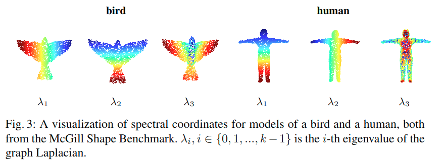

# Local Spectral Graph Convolution for Point Set FeatureLearning

## 什么是点云

点云数据是指在一个三维坐标系统中的一组向量的集合。这些向量通常以X,Y,Z三维坐标的形式表示，而且一般主要用来代表一个物体的外表面形状。

## 论文概览

**问题：**

在point clouds上的特征学习引入了如point-net++的深度学习框架，很有前景。但是到目前为止，仅利用了point的特征，忽略了与邻接点的连接及邻接点的特征。

**解决办法：**

用spectral graph convolution和新的图池化策略克服了这个困难。我们用递归聚类和分层池化策略取代了max pooling，该策略在spectral coordinates中判断节点相似性，并且聚类，然后汇总clusters里面的节点的信息，从而得到更好的特征表达。

**贡献：**

- 使用了spectral graph convolution
- 可在运行期间动态构建图，并即时计算Laplacian和分层次的池化
- 使用一种新颖而有效的图池化策略，该策略在谱坐标中判断节点相似性，并且聚类，然后汇总clusters里面的节点的信息

## 主要内容

本文提出的模型如Fig.1所示。

1. Input是描述蚂蚁表面形状的点云，作为Layer1的输入
2. 在Layer1中，首先对Input应用k-NN做Sampleing&Grouping，得到四个簇
3. 对每个簇内应用谱图卷积初步提取特征
4. 对每个簇内应用多次谱聚类和池化，得到Layer1的输出。
5. 将Layer1的输出作为Layer2的输入，重复上述步骤
6. 最后得到的Layer2的输出，我们可以将其应用于分类或者图分割

**创新点**

本文的创新点是相对pointnet++而言的。pointnet++在Sampleing&Grouping后，并没有应用谱图卷积，所以它没有考虑到邻节点k-NN(k nearest neighbor)的信息。

pointnet++使用的是简单粗暴的max pooling，而这里，是分层次地做pooling。例如Fig.1，它先将Sampleing&Grouping后产生的Group应用Spectral Convolution后，再应用Clustering，从而得到三个cluster。然后才是对每个cluster应用pooling。这样做的好处是，可以分层次地提取到点云上各个部分的信息，然后最后可以将各个部分的信息汇总一起，使其更好地完成分类任务。例如，对描述人头的点集做分类，人们想要的是同时学习和捕捉到鼻子、下巴和耳朵特征，而后结合这些特征完成人头的分类任务。

在谱聚类中，作者使用的谱坐标是基于Graph Laplacian L的低频特征向量，因为低频特征向量更能捕捉到粗略的形状特性(如Fig.3所示)。对应于第二小的特征值的特征向量广泛用于谱聚类，我们称这个向量为**Fiedler vector**。

**关于Recursive Cluster Pooling**

作者用Fiedler vector对k-NN做谱聚类。

首先按照其数值的升序对各个Fiedler vector条目进行排序，然后在第一次迭代中将其均匀分割成$k_1$个部分。Fiedler vector条目落在同一部分领域中的点将聚集在一起。这会得到簇大小为$c=\frac{k}{k_1}$的$k_1$个簇。然后对每个簇的簇内做池化，这使得网络能够利用k-NN中不相交的组成部分的特征。

至此产生了粗化后的$k_1$-NN图。

重复上述步骤。注意，我们交替使用max pooling和average pooling，以进一步增加图池化的区分能力。当剩余的点的数量小于或等于规定的簇大小时终止，然后对所得的整个图做池化。整个算法的步骤如Algorithm 1所示。

