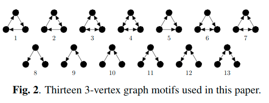
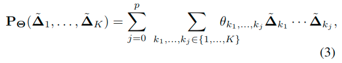
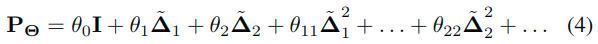
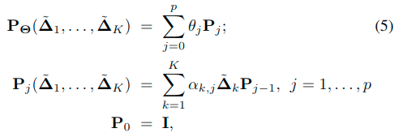
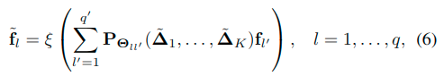

---
html:
  embed_local_images: true
  embed_svg: true
  offline: false
  toc: true

print_background: true
---

## MOTIFNET: A MOTIF-BASED GRAPH CONVOLUTIONAL NETWORKFOR DIRECTED GRAPHS

### 概览

**问题：**

spectral CNNs的一个关键的缺点是他们对无向图明确的假设，导致具有正交特征分解(orthogonal eigendecom-position)的对称拉普拉斯矩阵。

**解决办法：**

提出了MotifNet，一个能利用local graph motifs处理有向图的graph CNN。我们使用了一种注意力机制，使得MotifNet一般化标准的graph CNN，并且不会显著地增加模型复杂度。

### Dealing With Directed GRAPHS

- 谱图卷积假设图是无向图，拉普拉斯矩阵是否可以分解取决于邻接矩阵是否对称。但是当图是由向时这个条件就不成立了。
- 拉普拉斯算子是各向异性的，即在图上不存在preferred direction。因此，当底层图形是网格时，所得到的spectral filters是旋转对称的。虽然各向异性拉普拉斯算子和定向滤波器的构造在流形上可能是由于locally-Euclidean结构，但它在一般图上更具挑战性。

Benson et al.基于对称为motifs的小型子图的分析，提出了一个优雅的解决办法。另$G = \{ V, E, W\}$是一个带权重的有向图，另$M_1,...,M_k$表示graph motifs的集合（代表某些有意义的连通性模式的小型有向图;例如，图2描绘了三维图案的三顶点图案）

对有向图的每条边$(i, j) \in E$和每个motif$M_k$，令$u_{k, ij}$表示边$(i, j)$参与进$M_k$的数量（注意边可以参与到多个motifs）。定义新的边权重$\hat{w}_{k,ij} = u_{k,ij}w_{ij}$现在是一个对称motif邻接矩阵，我们记为$\hat{W_k}$。Motif Laplacian $\hat{\Delta}_k = I- \hat{D}_k^{-1/2} \hat{W_k} \hat{D}_k^{-1/2}$ associated with this adjacency acts anisotropically with a preferred direction along structures associated with the respective motif.

### MOTIFNET

本文的关键思想是在图形深度学习的背景下使用motif-induced adjacencies。我们使用应用于motif Laplacian matrices的度为p的multivariate polynomial滤波器在图上构造滤波器。注意由于矩阵乘法不满足交换律，我们有$K^p$个乘积$\hat{\Delta}_{k1}...\hat{\Delta}_{kp}$，当$k_l \in \{ 1,...,K\}$。一般的多元矩阵多项式具有这种形式

当$j=0$我们有一个0度项$\theta_0I$，$\Theta$表示所有系数的集合。总的来说，3式有$\frac{1+K^{p+1}}{1-K}$个系数，即使对于较小的K和p，这也是不切实际的。

因此，我们研究（3）的两种可能的简化。首先，我们只考虑K = 2的简单motifs，它们对应于来自顶点的输入和输出边缘。在这种情况下，多项式变成

其次，我们考虑用以下方式递归定义的多元多项式（3）的简化版本

其中$0 <= a_{i,j} <= 1$，$\Theta = (\theta_0,...,\theta_p,\alpha_{1,1},...,\alpha_{K,p})$表示系数的集合，共Kp+1个。

MotifNet是一种采用形式卷积层的神经网络架构

$q', q$表示输入输出的channel数。$P_{\Theta_{ll'}}$是简化的多元矩阵多项式。ChebyshevNet作为MotifNet的一个特殊实例，其中包含一个无向图的拉普拉斯算子，在这种情况下，使用单变量矩阵多项式。
