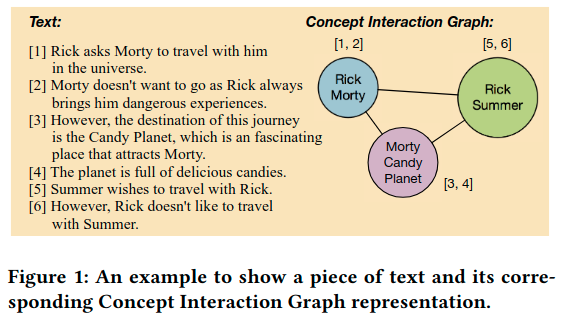
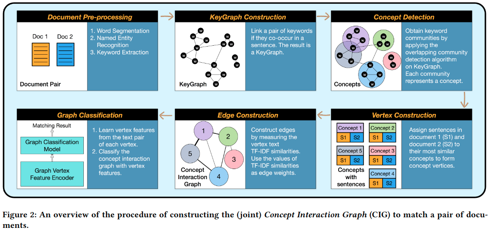
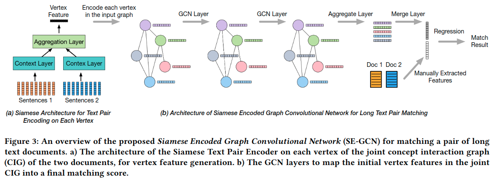

---
html:
  embed_local_images: true
  embed_svg: true
  offline: false
  toc: true

print_background: true
---
# Matching Long Text Documentsvia Graph Convolutional Networks

## Abstract

两个文本对象之间的关系识别是NLP下的一个核心研究课题，现在已经提出了广度深度学习方案来进行文本匹配，主要集中在句子匹配，疑问解答或查询文档。现有的方法在匹配长文档时表现并不好，原因是这些方法忽略或是未能充分利用复杂的语义结构。本文提出了一个基于图的文本匹配方法，尤其是针对长文档匹配。比如识别两篇新闻报道是否报道着同一个事件，只不过叙述不一样。

我们提出用Concept Interaction Graph（下面简称CIG）来产生文档的图表示。其中顶点代表不同的概念，一个顶点代表文档中一个或一组连贯的关键字；边代表不同概念之间的关系，由句子来决定顶点与顶点间的链接。

基于文档的图表示，我们提出了*Siamese Encoded Graph Convolutional Network*，它可以通过Siamese neural network学习顶点的表示，并且用GCNs来聚合顶点特征，以产生匹配结果。

我们用腾讯新闻产品中，两个标签下面的文章作为数据集，对所提出的方法进行评估，结果表明，我们的方法是state-of-art的。

## 1 CONCEPT INTERACTION GRAPH

给定文档$D$，我们的目标是找到它的图表示$G_D$。$G_D$中的每个顶点称为*concept*，$D$中的每个句子都会被分配到跟这个句子最相关的cencept节点。如果两个顶点所代表的句子集的相似性（e.g., TF-IDF相似性）大于阈值，那就把两个顶点用边连接起来。

Fig.1阐述了我们如何将一个文档转换为Concept Interaction Graph。我们使用标准的关键词提取算法提取关键词Rick，Morty，Summer，和Candy Planet。这些关键词将会进一步聚合成三个concept，每一个concept是关键词的subset，subset中的关键词都相互高度相关。然后，我们将文档中的句子分配到与它们最相关的cencept中。例如Fig.1句子[1, 2]都是关于Rick and Morty的，所以分配到（Rick，Morty）中。然后，我们以两个concept之间的相似性作为连接这两个concept的边的权重。

### 1.1 Construct Concept Interaction Graphs

给定文档$D$，如Fig.2所示做以下处理

1. 提取关键词
2. 用1提取的关键词构造图（KeyGraph），每个关键词都是一个顶点。如果一对关键词至少同时出现在一个句子中，我们则连接这一对关键词。
3. 如果关键词高度相关，他们将形成密集连接的子图，我们称之为concept。这一步我们可以用community detection algorithm来做。然后，我们将得到由关键词聚合成的concept
4. 构造顶点。由3得到concept后，下一步是将每个句子分配到跟它最相关的concept上。将句子有TF-IDF向量表示，然后计算每个句子与concept之间的余弦相似度。若相似度高于阈值，则该句子分配到对应的concept中。
5. 构造边。将顶点上的句子连接成一段长文本，计算两个顶点上的长文本之间的TF-IDF相似度作为边的权重。

## 2 A GRAPHICAL APPROACH TO DOCUMENT MATCHING

在这节，我们利用文档的图表示（CIG），提出Siamese Encoded Graph Convolution Network（SE-GCN）做文本匹配。Fig.3展示了模型的整体结构。

###  2.1 The Joint GIG for a Pair of Documents

由于我们的目标是对输入文档$D_A$和$D_B$之间的关系进行分类，因此我们需要一种机制来合并两个对应的CIG，即$G_A$和$G_B$，最终得到匹配分数。

一种简单的方法是建立一个“Siamese GCN”，其中$G_A$通过多层GCN编码成一个上下文向量，同样的过程应用于$G_B$。最后，我们可以匹配两个上下文向量，获得匹配分数。但是这种方法在实验中并没有取得很好的结果，因为最初的GCN层丢失了很多的信息，而比较却是在最后一层输出的编码向量进行的。

直观地说，利用CIG的一种更好的方法是比较每个顶点上的句子子集，并加权聚合比较的结果，以得到总体的比较结果。

为了使$G_A$和$G_B$能在顶点层面进行对比，并让这些顶点对比结果通过多个GCN层传播，我们提出了一种新的过程来合并一对CIG。具体来说，对于一对输入文档$D_A$和$D_B$，我们可以按照下面的步骤构建joint Concept Interaction Graph（joint CIG）：

- 将$G_A$和$G_B$的所有顶点放在同一个图，我们叫这个图为joint CIG
- 对于joint CIG里面的每个顶点$v$，与其相关的句子集为$\{S_A(v), S_B(v)\}$，其中$S_A(v)(or \  S_B(v))$是与$G_A(or \ G_B)$中的顶点$v$相关的句子。
- $w_{uv}$是顶点$u$和$v$之间的边的权重。这个权重是根据这两个顶点所代表的句子集$\{S_A(u), S_B(u)\}$和$\{S_A(v), S_B(v)\}$之间的TF-IDF相似度决定的

### 2.2 A Siamese Document Pair Encoder

对给定jont CIG $G_{AB}$，我们的下一步的任务是为每个顶点找到一个固定长度的特征向量来表示$S_A(v)$和$S_B(v)$之间的语义相似度和发散度，它表示文档$D_A$和$D_B$在v之间的差异。

为了减少人工的特征工程对结果的影响，我们用神经网络编码顶点特征。如图3(a)所示，我们将同一个Siamese Encoded Graph Convolution Network应用到$G_{AB}$的每个顶点上，以转换$\{S_A(v)，S_B(v)\}$中的词嵌入为一个固定大小的特征向量$m_{AB}(v)$。这个特征向量便作为该节点的特征。

然后，将joint CIG和节点特征放入GCN进行训练。经过两层GCN后，将最后一层GCN输出的所有顶点的特征向量（这些顶点的特征向量保留了整个图的结构特性，并且信息损失最小）的平均值作为合并表示。再与从两个文档中手动提取的特征，一起作为回归任务的特征。最后由回归算法得到两个文本的匹配分数。
