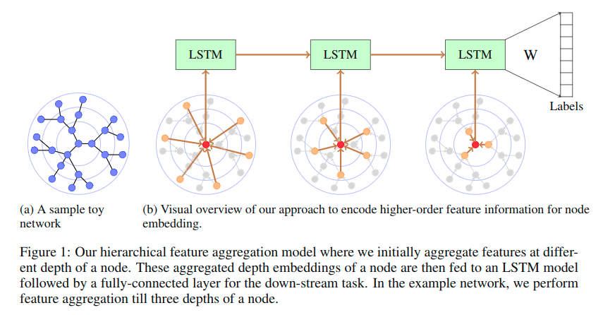

# NETWORK EMBEDDING USING HIERARCHICAL FEATURE AGGREGATION

## 1 Introduction

GCN及其变种不能有效地获取距离节点有一定深度的节点信息，于是我们提出了一种新的层次特征聚合方法，它使用LSTM获取邻接点的不同深度的信息。与最先进的方法相比，所提出的模型在四个真实世界的数据集上有了不错的结果。

**问题：**

GCN, GraphSAGE(and their variants)有两个主要局限：

1. 不能高效获取超过第二跳的节点信息。GCN超过两跳需要多于指数倍的计算能力，在许多现实数据上实际上不可行。Graph SAGE考虑了抽样后的邻接点，但是并没有在超过两跳的深度上有更多的提高。
2. GraphSAGE和GCN都是迭代地将邻接节点的信息传递到节点上，即更深的信息通过较低深度的节点传播。因此，更深的邻接节点在将信息传递到当前节点前会被多次平均化，引起信息的变化。

**贡献：**

我们提出了hierarchical feature aggregation approach，它会在不同深度的邻域上学习不同的特征聚合器。然后使用LSTM聚合不同深度的信息，从而确保信息从更高的深度流向节点。

## 2 Proposed Model

**符号标记**

- $G = (V, E, X, L)$
- $V$是顶点集合
- $E$是边集合
- $X$表示顶点上的特征
- $L$表示顶点的label
- $N_v^{(k)}$表示顶点$v$第$k$跳的邻接点
- 顶点$v$的隐藏层表示为$h_v$
- 顶点$v$第k跳的隐藏层表示为$h_v^{(k)}$

**Hierarchical Fearure Aggregation Model**

如Fig.1所示。该模型的做法就是，将第k跳的邻接点的隐藏层特征用aggregation method（例如GraphSAGE），合并成一个向量。

$$h_v^{(k)} = AGGREGATE(\{h_u: \forall u \in s(N_v^{(k)}) \})$$

- $s(x)$表示集合

用同样的方法我们可以得到不同深度k的$h_v^{(k)}$。于是有

$$h_v = LSTM(\{h_v^{(K)}, h_v^{(K-1)} ,..., h_v^{(1))}\})$$

最后将学到的向量$h_v(\{h_v, \forall v \in V\})$作为全连接层的输入，以用来做分类任务。
