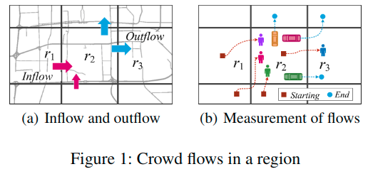
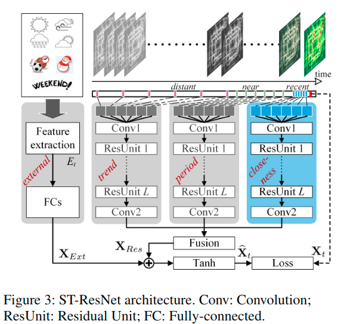
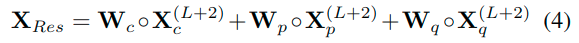

# Deep Spatio-Temporal Residual Networks for Citywide Crowd Flows Prediction

## Introduction

人流量的流入流出的难点在于：

1. 空间依赖：例如r2的流入量受周边区域的影响。
2. 时间依赖：例如8am发生的交通堵塞会影响9am；工作日早上的交通拥堵时间都差不多；冬季由于太阳比较晚升起而且温度较低，人们起床会比较晚，拥堵时间可能也会延后。
3. 额外因素：例如天气和事件。

为了解决这些难点我们提出了`deep spatio-temporal residual network(ST-ResNet)`去集体预测每个区域的流入和流出。我们的贡献有以下四点：

- 对任意两个区域之间的附近和远距离空间的相关性进行建模，同时确保模型的预测精度不包括神经网路的深层结构。
- 将人流的时间属性总结为三个类别，包括时间紧密度，周期和趋势，分别用三个residual network来模拟这些属性。
- ST-ResNet动态聚合上述三个网络的输出，为不同的分支和区域分配不同的权重。聚合额外因素（如天气）。

## Deep Residual Learning

Deep Residual Learning允许卷积神经网络有很深的结构，并且这个方法在不同的识别任务都取得了state-of-art的结果，包括图像分类，物体检测，分割，定位。

正式地，一个residual单元定义如下：

$$X^{(l+1)} = X^{l} + F(X^{(l)}) \tag{1}$$

- $X^{(l+1)}$和$X^{(l)}$是第$l^{th}$层的输入和输出
- $F$是residual function，例如两层CNN。有些实现是$F = W_2 \sigma(W_1 X)$

Residual learning的中心思想是学习关于$X^{(l)}$的additive residual function $F$。

## Model

后面就没什么好讲的了，一张图

其中

**loss function**

预测的flow matrix与真实的之间的差平方

$$L(\theta) = || X_t - \hat{X_t} || ^2_2$$

评估用的是RMSE

后面就没什么东西了。
