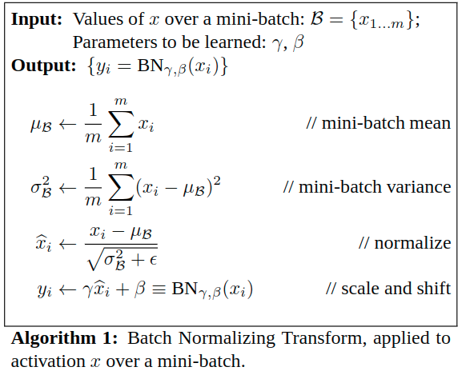

## Why

如$tanh(x)、Relu(x)$这类激活函数会将输入值限制在[-1, 1]、[0, 1]的值域上。这个过程有个问题，就是假设x中有一个值比较大，其他比较小，那么经过激活函数之后，这个值会明显比其他值大，其对应的神经元会很活跃；而其他较小的值对应的神经元的输出就会变得微不足道，就像失去了活性。

还有就是，tanh在[-2, 2]区间外的值都趋近于1，辨识率很低

为了避免这些情况，需要将数据放入激活函数前做Batch normalization，

## How

BN本质上就是使数据的分布服从标准正态分布，这样数据95.449974%会集中在[-2$\sigma$, 2$\sigma$]中。第4个公式`can be viewed as an input to sub-network composed of linear transform`，$\gamma、\beta$是模型自己学习的扩展参数和平移参数，目的是`fixed means and variances`。

 

下图是正态分布：

