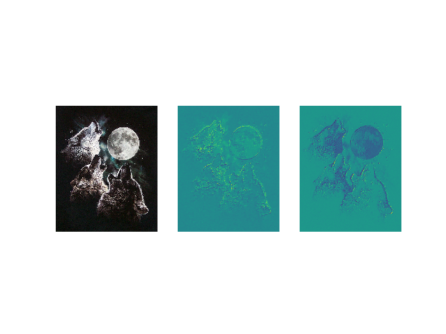
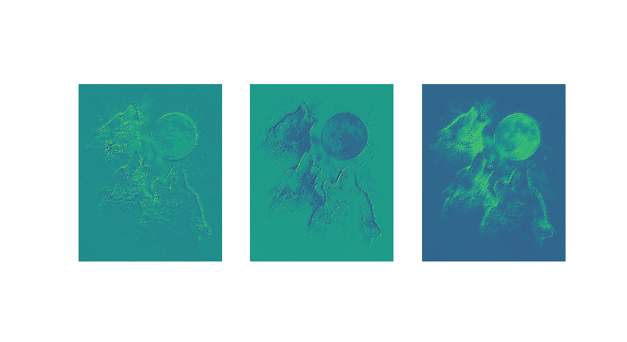

# [原文链接](http://deeplearning.net/tutorial/lenet.html)

### 代码解读
```python
import theano
from theano import tensor as T
from theano.tensor.nnet import conv2d
import numpy

rng = numpy.random.RandomState(23455)

# instantiate 4D tensor for input
input = T.tensor4(name='input')

# initialize shared variable for weights.
w_shp = (2, 3, 9, 9)
w_bound = numpy.sqrt(3 * 9 * 9)
W = theano.shared( numpy.asarray(
            rng.uniform(
                low=-1.0 / w_bound,
                high=1.0 / w_bound,
                size=w_shp),
            dtype=input.dtype), name ='W')
'''
用uniform初始化
不知为何定义shape为(2, 3, 9, 9)
'''


# initialize shared variable for bias (1D tensor) with random values
# IMPORTANT: biases are usually initialized to zero. However in this
# particular application, we simply apply the convolutional layer to
# an image without learning the parameters. We therefore initialize
# them to random values to "simulate" learning.
b_shp = (2,)
b = theano.shared(numpy.asarray(
            rng.uniform(low=-.5, high=.5, size=b_shp),
            dtype=input.dtype), name ='b')

# build symbolic expression that computes the convolution of input with filters in w
conv_out = conv2d(input, W)

# build symbolic expression to add bias and apply activation function, i.e. produce neural net layer output
output = T.nnet.sigmoid(conv_out + b.dimshuffle('x', 0, 'x', 'x'))

# create theano function to compute filtered images
f = theano.function([input], output)


import numpy
import pylab
from PIL import Image

# open random image of dimensions 639x516
'''
这里要加'rb'，不然报Unicode错，字符不能以utf-8编码，16，32都不行
'''
img = Image.open(open('doc/images/3wolfmoon.jpg', 'rb'))
# dimensions are (height, width, channel)
img = numpy.asarray(img, dtype='float64') / 256.

# put image in 4D tensor of shape (1, 3, height, width)
'''
这里img.shape = (639, 516, 3)
img.transpose(2, 0, 1).shape = (3, 639, 516)
img_.shape = (1, 3, 639, 516)
reshape将数组变成
0：1
  0：3
    0：639
      0：516
这个样子
初步估计，首先3是图像的RGB，后面的是尺寸。为方便处理，转换成3在前面。
然后由于input定义为4D的所以要做这个处理。对input的4D分别是：
> mini-batch size, number of input feature maps, image height, image width
'''
img_ = img.transpose(2, 0, 1).reshape(1, 3, 639, 516)
filtered_img = f(img_)
'''
filtered_img.shape(1, 2, 631,508)
不理解为何处理后变为2
更新：是由W,b的shape决定的，当改为3，输出也是3
改为3后如图三所示
'''
# plot original image and first and second components of output
pylab.subplot(1, 3, 1); pylab.axis('off'); pylab.imshow(img)
'''
这句的作用是将处理后的结果以灰图显示，若不加如图二
'''
pylab.gray();
# recall that the convOp output (filtered image) is actually a "minibatch",
# of size 1 here, so we take index 0 in the first dimension:
pylab.subplot(1, 3, 2); pylab.axis('off'); pylab.imshow(filtered_img[0, 0, :, :])
pylab.subplot(1, 3, 3); pylab.axis('off'); pylab.imshow(filtered_img[0, 1, :, :])
pylab.show()
```





