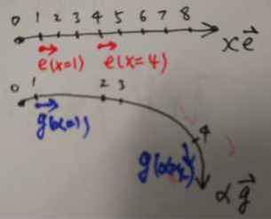

##　黎曼几何.docx

### 文章１

本文首先介绍了什么是流形。一般欧式空间是相互垂直的坐标系所构成的空间，**它只是流形的其中一种，而流形是最本质的**。

为了研究流形，黎曼在一般的流行上定义了一种特殊的度量，我们称为 **黎曼度量**。

**测地线**：在流形上两点间的距离最短的线。**如何确定这条线**：取北京，上海，地心三个点，我们知道三个点确定一个平面，这个平面和我们的地表相交于一个大圆，北京和上海都在那个圆上，你只要沿着短的那条弧线从北京跑到上海，数学保证你走的路最短。

**虽然最短的是测地线，但是测地线不一定是最短的**。比如说二维平面上，x正半轴上有个点A，x负半轴上也有个点B，正常来说AB连线就是最短的。但是如果我将原点挖掉，那么最短的便走不了了，便要绕一下路，那走出来的就不是最短的了。

### 文章2

欧几里得空间就是能用笛卡尔坐标系表示的空间。

**欧氏空间与黎曼空间的区别**

- 基标矢量：在笛卡尔系里，我们一般默认了尺规是单位1，一般也不标注。这里我们把它带上单位，这个单位带上方向就是基标矢量。

在第一条黑色的线里（欧氏线空间里的线），各个间隔相同，而且，基标矢量e（它是矢量哟）的方向也一致。基标矢量连成的线是直的（红色的），也就是说，基标矢量的斜率是0，就是说基标矢量的导数是0（导数、斜率和梯度一个意思，这里），也就是说，它！不！！弯！！！

再看下面的黑线（黎曼线空间里的线），每个号码之间的间隔不同，而且，基标矢量g的方向也在一直变（看蓝色），也就是说，这个线空间是弯曲的！而且，这个基标矢量的大小不一定是1哟。

Riemann Chiristoffel Tensor，也叫Riemann Curvature Tensor，黎曼曲率张量，用R表示。R是一堆Christoffel符号的组合。**简单来说，$R=0$(无曲率)是欧式空间，$R>0$是黎曼空间**。

是不是欧氏空间不能用曲面？

否，有个**等距变换**的概念在里面。

例如，平面是二维的Euclidean空间，**如果将平面进行弯曲，这个过程中保持面上的线段长度都不变，于是平面能变成圆柱面等，这个就是等距变换**。在等距变换后的面上，Euclidean几何学仍然适用，所以这个圆柱面也是Euclidean空间。

一个不同的例子，是球面。在球面上，Euclidean几何学是不适用的，而且平面也无法通过等距变换变为球面。

## Ollivier里奇曲率.docx

## 闵科夫斯基空间、罗氏几何、黎曼几何这三者的联系、区别分别是什么？

- https://www.zhihu.com/question/40986006?sort=created

## 维度学习、流形学习、度量学习

- http://www.cnblogs.com/taojake-ML/p/6148932.html

#### 流形学习

- 把一组高维空间中的数据在低维空间中重新表示，是一种降维方法

## 西瓜书

#### 度量学习

在原来的欧氏距离上，给每一项引入权重$w$，通过学习确定。只是，由于$W = diag(w)$是对角阵，意味着坐标轴是正交的，即属性之间是无关的。这不符合现实问题，所以，将$W$替换为一个普通的半正定对称矩阵$M$，
