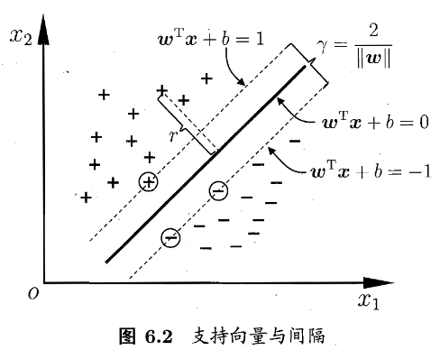

## Intro

SVM通俗来说就是找到一个超平面将不同类别的样本划分开。划分超平面可通过如下线性方程描述：

$$w^Tx+b=0 \tag{1}$$

- $w=(w_1;w_2;...;w_d)$为法向量，决定了超平面的方向
- $b$为位移项，决定超平面与原点之间的距离

任意点 $x$ 到超平面的距离

$$r = \frac{|w^Tx+b|}{||w||} \tag{2}$$

**为什么加$||w||$？**

- 若是以分子的公式计算，$w$ 和 $b$ 扩大两倍，虽然表示的还是同一个平面（$2(ax+b)=0$），但是计算出来的距离会扩大两倍。为了fix这个bug，加入归一化操作，也就是分母。个人理解，单单$||w||$还是不够的，需要约束$w$.

>几何间隔和距离公式的推导需要看看

然后，对二分类来说，样本$(x_i, y_i) \in D，正样本y_i=-1，负样本y_i=1$，则有

$$\begin{cases}
w^Tx_i+b \geqslant +1,\ y_i=+1; \\
w^Tx_i+b \leqslant -1,\ y_i=-1.
\end{cases} \tag{3}$$

**满足(3)式的超平面有无数个，我们如何选择？**

首先定义**suport vector**，它指的是到平面距离最近的几个样点。根据假设和公式，最近的点到平面的距离为1，因此两个异类的suport vector到超平面的距离之和为，称为**margin(间隔)**

$$\gamma=\frac{2}{||w||} \tag{4}$$

于是我们的目的就是，找到**maximum margin(最大间隔)** ，在满足(3)式的情况下，使得(4)式最大。等同于

$$
\mathop{min}\limits_{w,b} ||w||^2 \\
s.t. \ \ y_i(w^Tx_i+b) \geqslant 1, i=1,2,...,m.
\tag{5}$$

这就是SVM的基本型。

## 对偶问题

>这部分在看《统计学习方法》的时候补充

这里讲的主要是如何求解(5)式。利用拉格朗日乘子法，可以将形如(5)式的带有约束的问题(s.t.)转化为(6)式：

$$L(w,b,\alpha) = \frac{1}{2}||w||^2 + \sum_{i=1}^{m} \alpha_i (1-y_i(w^Tx_i+b)) \tag{6}$$

- m 为训练样本的个数

令$w, b$的偏导为0，化简后得到(7)式

$$
\mathop{max}\limits_{ \alpha } \sum_{i=1}^m \alpha_i - \frac{1}{2} \sum_{i=1}^m \sum_{j=1}^m \alpha_i \alpha_j y_i y_j x_i^T x_j \\
s.t. \sum_{i=1}^m a_i y_i = 0 \\
a_i \geqslant 0 , i = 1,2,...,m.
\tag{7}$$

所以要求解(5)式SVM的基本型，归根到底，就是要**求出(7)式的$\alpha_i$，进而得到$w, b$**，于是便可得到超平面。

**接下来，问题就是如何求 $\alpha_i$ 了**。这里用的方法叫**SMO(Sequential Minimal Optimization)** 。这部分由于其他提及比较少，所以略过。

## 核函数

**思路：**

将**原始样本空间映射到高维空间中**($x \mapsto \phi(x)$)，那么它就比较容易找到一个超平面划分样本。只是由(7)式可知，我们需要计算$x_i^T x_j$，映射过来就是$\phi(x_i^T) \phi(x_j)$。由于**维度可能很高**，所以计算这个式子难度可能会比较大，于是就假设有个**原始空间**中的函数，有

$$k(x_i,x_j) = \langle \phi(x_i), \phi(x_j) \rangle = \phi(x_i^T) \phi(x_j)$$

这个技巧就叫做**kernel trick**(核技巧)，$k(x_i,x_j)$就叫做**kernel function**(核函数)

**只要一个对称矩阵是半正定的，那么就可以作为核函数来使用。对于一个半正定矩阵，总能找到$\phi$与之对应。换言之，任何一个核函数都隐式定义了一个称谓再生希尔伯特空间的特征空间。**
