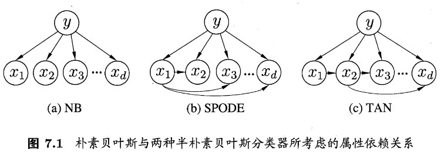

## Bayesian decision theory

- 本章先介绍一些基本定义，然后开始拓展

### 基本定义

**Bayes' theorem**

$$P(A|B)=\frac{P(A) \times P(B|A)}{P(B)}$$

- $P(A)$称为**先验概率或边缘概率**，之所以称为先验是因为它不考虑B方面的因素
- $P(A|B)$是已知B发生的情况下A的概率，也由于得自B的取值而被称之为**A的后验概率**
- $P(B)$称为**先验概率或边缘概率**，之所以称为先验是因为它不考虑A方面的因素
- $P(B|A)$是已知A发生的情况下B的概率，也由于得自A的取值而被称之为**B的后验概率**

 

**现假设：**

有N个类，$Y=\{c_1, c_2, ... , c_N\}$，$\lambda_{ij}$是将类$c_j$误分类为$c_i$所产生的损失，则 **expected loss(期望损失)，也就是conditional risk(条件风险)** 为：

$$R(c_i|x) = \sum_{j=1}^{N} \lambda_{ij} P(c_j|x) \tag{1}$$

- >Expected loss is the sum of the values of all the possible losses, each multiply by the probability of that loss occurring
- 但是(1)式想表达的是，将$x$分类为$c_i$所产生的loss，所以应该是所有其他本应分类为$c_j$的样本误分类为$c_i$所产生的loss的期望。

**我们的任务是：**

找到$h: X \mapsto Y$，以最小化总体风险

$$R(h)=E_x [R(h(x)|x)]$$

由此产生 **Bayes decision rule(贝叶斯判定准则)**：为最小化总体风险，只需在每个样本上选择能够使$R(c|x)最小的类别标记，即:$

$$h^* (x) = \mathop{arg\ min}\limits_{c \in Y} R(c|x)$$

- $h^* $被称为**Bayes optimal classifier(贝叶斯最优分类器)**
- $R(h^* )$被称为**Bayes risk(贝叶斯风险)**
- $1-R(h^* )$是分类器所能达到的最好的性能，也是理论上限

**令：**

$$
\lambda_{ij} = \begin{cases}
0, \ if \ \ i = j; \\
1, \ otherwise.
\end{cases}$$

则

$$R(c|x) = 1 - P(c|x)$$

- 其中$c$为x的真实类别

**上面的任务等价为找到$h^* (x)$，使得**

$$h^* (x) = \mathop{arg\ max}\limits_{c \in Y} P(c|x)$$

### 生成式模型 vs 判别式模型

之前一直分不清两种模型的区别，因为在我看来，两种模型都能够通过贝叶斯公式统一起来。看了西瓜书才明白区别在哪。简单来说，生成式模型直接预测$P(x,c)$，然后再获得$P(c|x)$；判别模型直接建模$P(c|x)$来预测$c$。

**对生成式模型(generative models)来说**

$$P(c|x) = \frac{P(x,c)}{P(x)}$$

即：

$$P(c|x) = \frac{P(c)P(x|c)}{P(x)}$$

$P(c)$可以根据大数定律，当训练集包含足够的独立同分布样本时，$P(c)$可以通过各类样本出现的频率进行估计

对于给定样本$x$，$P(x)$与类标记无关

所以问题就是**如何求得$P(x|c)$了**

### 极大似然估计

- **Maximum Likelihood Estimation，简称MLE**

假定$P(x|c)$具有确定的形式并被$\theta_c$唯一确定，**那么我们的任务就是找到$\theta_c$，使得下面式子概率最大**

$$P(D_c | \theta_c) = \mathop{\prod} \limits_{x \in D_c} P(x | \theta_c)$$

- 其中$D_c$是类别为$c$的样本集合

由于连乘操作容易造成下溢(可能是数值太小在计算机中容易越界)，所以用$log$

$$\begin{aligned}
LL(\theta_c) &= log\ P(D_c | \theta_c) \\
             &= \sum_{x \in D_c} logP(x | \theta_c)
\end{aligned}$$

$$\hat{\theta}_c = \mathop{arg\ max}\limits_{\theta_c} \ LL(\theta_c)$$

### 朴素贝叶斯分类器

- 由于$P(x|c)$是所有属性的联合概率，难以从有限样本直接估计得到。为了避开这个障碍，Naive Bayes Classifier假设所有属性相互独立。

所以朴素贝叶斯分类器的表达式为：

$$h_{nb}(x) = \mathop{arg\ max}\limits_{c \in y} P(c) \prod_{i=1}^{d} P(x_i|c)$$

- $P(c) = \frac{|D_c|}{D}$，$D_c$是集合$D$中类别为$c$的样本组成的集合
- 对连续属性而言，可以假设$P(x|c)$服从某概率密度函数而求得，比如正态分布
- 对离散属性，$P(x_i|c) = \frac{|D_{c,x_i}|}{|D_c|}$，$|D_{c,x_i}|$表示集合$|D_c|$中，取值为$x_i$的样本的集合。有时因为属性值缺失，$|D_{c,x_i}|$会为0，这个时候我们会进行**平滑(smoothing)** ，常用**拉普拉斯修正(Laplacian correction)**

**拉普拉斯修正(Laplacian correction)**

$$P(c) = \frac{|D_c| + 1}{D + N}$$

$$P(x_i|c) = \frac{|D_{c,x_i}| + 1}{|D_c| + N_i}$$

### 半朴素贝叶斯分类器

- 朴素贝叶斯的假设属性条件相互独立，这在现实生活中往往很难成立。所以人们松绑一下，**适当考虑一部分属性的相互依赖信息，这样既不用计算完全的联合概率，又保留了和强相关属性之间的依赖关系**，这种就叫“**半朴素贝叶斯分类器**”(semi-naive Bayes classifiers)

**独依赖估计**

假设每个属性最多仅依赖一个其他属性(即"**独依赖估计**"，One-Dependent Estimator，简称ODE)。

这些方法都属于ODE

- **SPODE**(Super-Parent ODE)
- **TAN**(Tree Augmented naive Bayes)
- **AODE**(Averaged One-Dependent Estimator)

**TAN**

- 基于最大带权生成树(Maximum weighted spanning tree)

1. 计算两个属性之间的条件互信息

$$I(x_i, x_j|y) = \sum_{x_i,x_j;c \in y} P(x_i, x_j|c) log \frac{P(x_i,x_j|c)}{P(x_i|c)P(x_j|c)}$$

2. 以属性为顶点，两属性的$I(x_i, x_j|y)$为边，构成图
3. 挑选根节点，将边置为有向
4. 加入类别节点$y$，增加$y$到各个属性的有向边

---

略一部分

---

### EM算法

- 现实中，有时候训练样本是缺失的，某些属性变量值未知，比如西瓜根蒂已脱落，就无法看出是“蜷缩”还是“硬挺”。那么如何估计呢？
