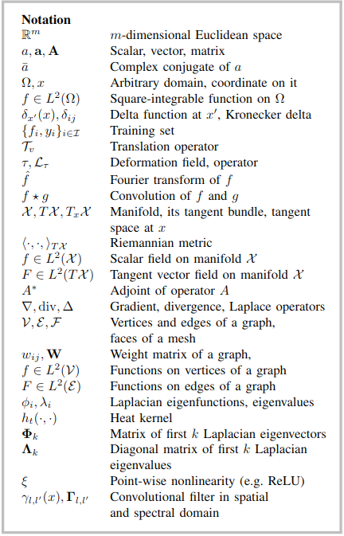
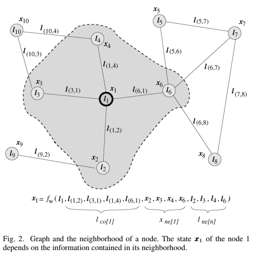

# 开篇预备知识

### 1. 欧几里得空间与非欧空间

  - 欧几里得空间指的是平直的空间，在这里两条平行线不会相交
  - 非欧空间里，由于空间的扭曲（如重力作用），会导致两条平行线有可能相交

### 2. word embedding

embedding在数学上表示一个mapping，f:X->Y。WE将单词映射到另一个空间，每个词在此空间都用一个vector表示

### 3.  $p(\theta|x) = \frac{p(x|\theta)p(\theta)}{p(x)}$

> **$p(\theta|x)$ posterior**， **$p(x|\theta)$ likelihood**， **$p(\theta)$ prior**， **$p(x)$ evidence**

>一个具体例子 —— 作者：徐鹏
链接：https://www.zhihu.com/question/24261751/answer/153991968
来源：知乎
>>似然函数，是根据已知结果去推测固有性质的可能性（likelihood），是对固有性质的拟合程度，所以不能称为概率。在这里就是说，不要管什么瓜熟的概率，只care瓜熟与蒂落的关系。如果蒂落了，那么对瓜熟这一属性的拟合程度有多大。似然函数，一般写成L（瓜熟 | 已知蒂落），和后验概率非常像，区别在于似然函数把瓜熟看成一个肯定存在的属性，而后验概率把瓜熟看成一个随机变量。

### 4. equivariant & invariant

equivariant 和 invariant 有时会混用

invariant指的是对一个图像$I$进行变换（不知道非线性变换是否也invariant）后得到的图像$I'$ ，它们的图像性质是一样的（例如最大值）

equivariant对$I$和$I'$ 用式子表示相等的关系

> Let us start from simple image features, and suppose that image II has a unique maximum mm at location (xm,ym)(xm,ym). An interesting property of classifiers is the ability to classify in the same manner some distorted versions I′I′ of II, for instance translations by all vectors (u,v)(u,v). The maximum m′m′ of I′I′ is invariant: m′=mm′=m. While its location will be at (x′m,y′m)=(xm−u,ym−v)(xm′,ym′)=(xm−u,ym−v), and is equivariant, meaning that is varies "equally" with the distortion. [参考](https://datascience.stackexchange.com/questions/16060/difference-between-equivariant-to-translation-and-invariant-to-translation)

### 5. Square-integrable function

>平方可积函数（英语：square-integrable function）是绝对值平方的积分为有限值的实值或复值可测函数。

若有$f(x)$满足以下式子


则称其在 $(-\infty, +\infty)$ **平方可积**


# Introduction

## 介绍deep learning
```
成功原因 => 利用统计特性 - 在欧几里得空间中的特性

在上面的setting下有如下东西：
shift-invariance => stationarity
local connectivity => locality
multi-resolution structure of the grid 多分辨率网格 => compositionality stems 组合（将的模型不同size的conv pool）
```

## Purpose

介绍能将已有的深度学习方法的key ingredients转换为非欧空间数据的方法

# Geometric learning problems

## 分为两类问题

### 描述数据的结构/域

> Structure of the domain

做法就是，算了，给原文

> first, they start with constructing a representation of local affinityof the data points (typically, a sparsely connected graph).
Second, the data points are embedded into a low-dimensionalspace trying to preserve some criterion of the original affinity.

例如将word embedding应用到graphs上

### 处理定义在非欧空间的分析函数

> Data on a domain

例如处理社交网络，例如定义operation similar to connectivity使得可以使用CNN model

## III Deep learning on Euclidean domain



#### Local deformations and scale separation

##### 主旨

- 说明局部变换的稳定性原则

>In other words, whereaslong-range dependencies  indeed exist in natural images andare critical to object recognition, they can be captured anddown-sampled at different scales. This principle of stabilityto local deformations has been exploited in the computervision community in models other than CNNs, for instance,deformable parts models[58]

##### 问题

- 何谓local deformation,local不local有什么区别。何谓local translations，与前者有什么区别

#### Convolutional neural networks

##### 主旨

- 讲了下CNN，其优点 ——
- geometric priors
- stationarity and local deformation priors

##### 问题

- 卷积的数学表示以及其运算性质

## IV The Geometry of manifolds and graphs

#### Manifolds

- > Roughly, a manifold is a space that is locally Euclidean
- 说，tangent space的inner product是一个$R$，并且将这种inner product成为Riemannian metric
- 一个带这种metric的manifolds称为Riemannian manifolds
- tangent vector field:
  >


##### 问题

- manifolds里面说的inner product指的是谁跟谁？自己跟自己？得出来的结果是啥？

#### Calculus on manifolds



$dx$ : d-dimensonal volum element induced by the Riemannian metric 黎曼空间里面的d-dim体积元素

$L^2(X)$ : Hilbert spaces of scalar

$L^2(TX)$ : vector fields on manifolds
