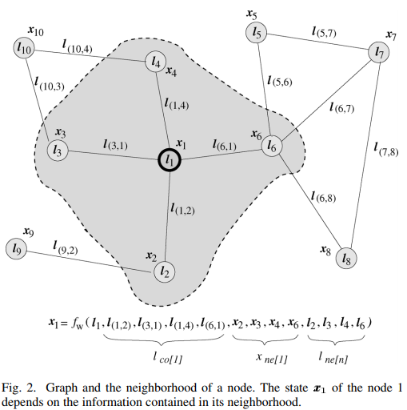
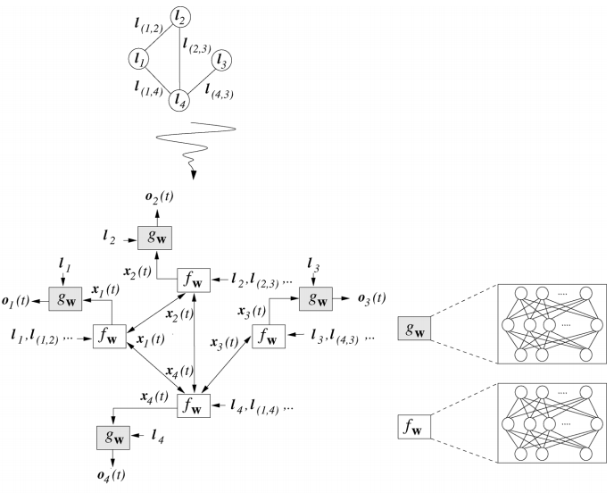
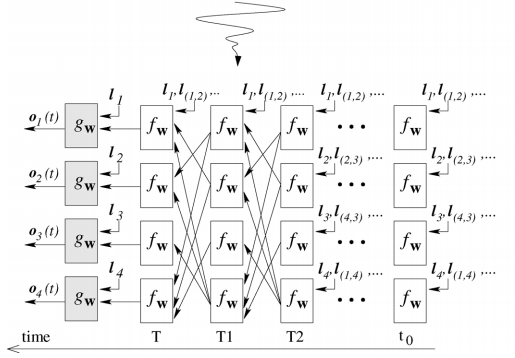
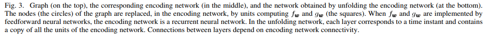

# GNN，GG-NNs，GGS-NNs简介

## 三者之间的关系

```dot
digraph G{
  GNN -> GG-NNs
  GG-NNs -> GGS-NNs
}
```




$l_1$ 节点1的label

$x_1$ 节点1的状态

$l_{(1,2)}$ 一条从节点1到节点2的边

$f_{w}$ transition function

$l_{co[1]}$ 与节点1相连的所有边

$l_{ne[1]}$ 节点1的所有邻节点





.


