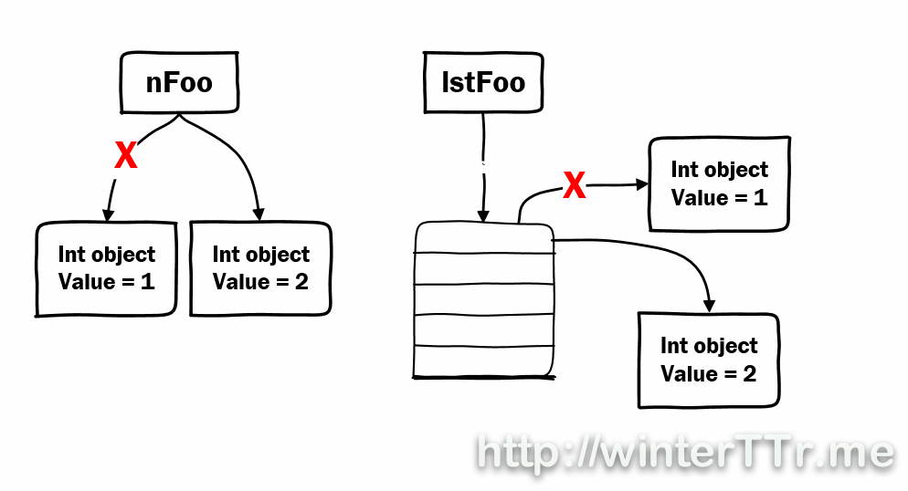

学过C/C++的人，可能会有这样的疑问：python中函数参数的传递是值传递还是地址传递？

实际上，python中并没有这种说法。这就像刚发明蒸汽机那一会，瓦特向众人展示以蒸汽机作为动力的火车，完了后，众人说：嗯，你说的原理我都理解了。可是马在哪里呢？

python的变量只有两种情况：`可变对象mutable`(list, dict等)和`不可变对象immutable`(number, string, tuple)。所有的参数传递，其过程与赋值一样，可以看下面这个例子：

```python
nfoo = 1
nfoo = 2

lstFoo = [1]
lstFoo[0] = 2
```

其实际过程如下：



```python
def ChangeInt( a ):
    a = 10
nfoo = 2
ChangeInt(nfoo)
print nfoo #结果是2
```

```python
def ChangeList( a ):
    a[0] = 10
lstFoo = [2]
ChangeList(lstFoo )
print nfoo #结果是[10]
```


**参考**

1. http://winterttr.me/2015/10/24/python-passing-arguments-as-value-or-reference/
