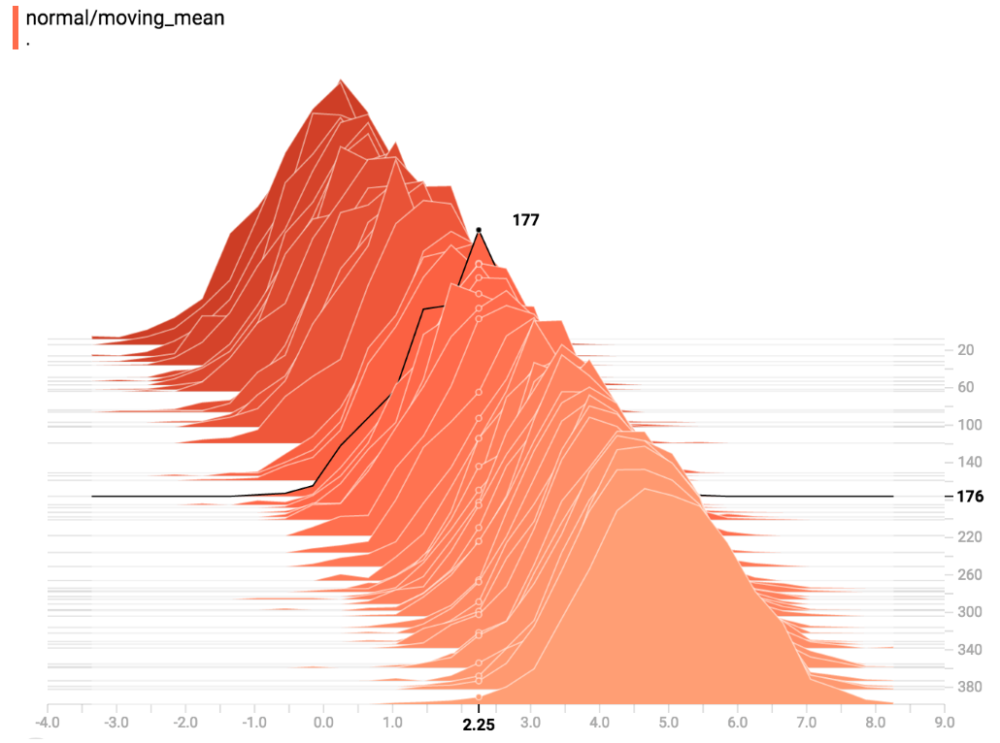

## 很好的教程

- https://www.jianshu.com/p/d059ffea9ec0

## 画image

对MNIST数据集，capsule的reconstruction部分是这样做的：

```python
# 其中 # len(images)=3，分别为3个fc层的结果
# images[0] [128, 28, 28, 1]
# images[1] [128, 28, 28, 1]
# images[2] [128, 784]

images_3d = []
    for image in images:
      image_3d = tf.reshape(image, [-1, image_depth, image_dim, image_dim])
      images_3d.append(tf.transpose(image_3d, [0, 2, 3, 1]))

# concat之后变为[128, 84, 28, 1]
# 即将三个图像从上到下排列，合并成一张图了
image_remake = tf.concat(images_3d[:3], axis=1)

# 10是显示batch为128的前十张图
tf.summary.image('reconstruction', image_remake, 10)
```

## 画histogram



上图的意思是，在176步，以2.25为中心的bin中，有177个值

>tf.summary.histogram采用任意大小和形状的Tensor，并将其压缩成由许多具有宽度和计数的仓组成的直方图数据结构。 例如，假设我们要将数字[0.5,1.1,1.3,2.2,2.9,2.99]组织成bin。 我们可以做三个bin：一个包含从0到1的所有东西的bin（它将包含一个元素，0.5），一个包含1-2中所有内容的bin（它将包含两个元素，1.1和1.3），一个bin一切从2-3（它将包含三个要素：2.2,2.9和2.99）。
TensorFlow使用类似的方法创建bin，但与我们的示例不同，它不会创建整数bin。 对于大的稀疏数据集，这可能会导致数千个分区。 代替， 箱子是指数分布的，许多箱子接近零，并且相对较少的箱子非常大。 然而，可视化指数分布的分组是棘手的；如果使用height来编码count，那么更宽的bin会占用更多的空间，即使它们具有相同数量的元素。 相反，该区域的编码计数使得高度比较是不可能的。 相反，直方图将数据重新取样成均匀的分区。 在某些情况下，这可能会导致不幸的文物。

详情参考 http://python.usyiyi.cn/documents/tensorflow_13/get_started/tensorboard_histograms.html

**OVERLAY**

这个模式可以按步数看数值的变化
