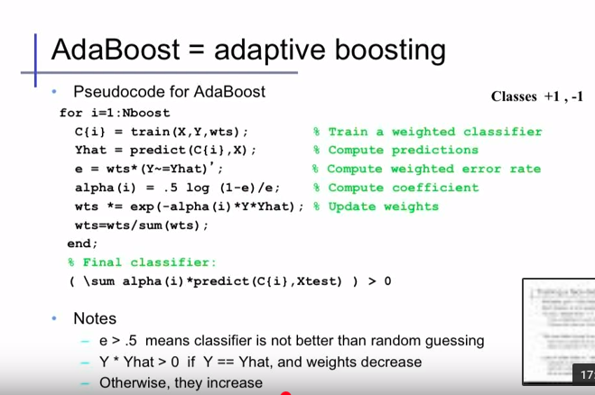
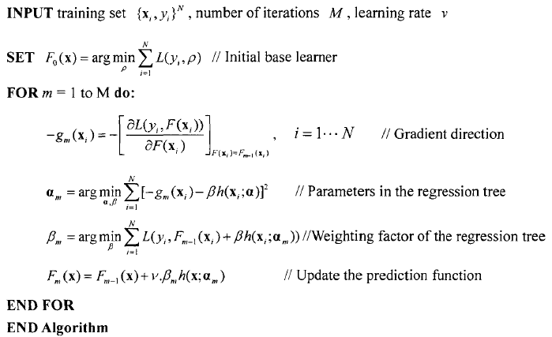

# Boosting

资料

- [深入浅出ML之Boosting家族](http://www.52caml.com/head_first_ml/ml-chapter6-boosting-family/)

**弱可学习和强可学习**

- 一个概念（一个类，label），如果存在一个多项式的学习算法能够学习它，并且正确率很高，那么就称这个概念是强可学习的
- 一个概念（一个类，label），如果存在一个多项式的学习算法能够学习它，学习的正确率仅比随机猜测略好，那么就称这个概念是弱可学习的。

Schapire后来证明了: 强可学习和弱可学习是等价的。 也就是说，在PAC学习的框架下，一个概念是强可学习的 充分必要条件 是这个概念是弱可学习的。 表示如下：

$$强可学习⇔弱可学习$$

## AdaBoost

[视频链接](https://www.youtube.com/watch?v=ix6IvwbVpw0)

**关键词**

- 依次训练多个分类器，每次都对前一个作改进
- 错误分类的样本权重变大，正确分类的样本权重下降
- $\alpha$
- 指数损失函数

**缺点**

- 对异常点敏感 —— 由指数损失函数带来的
- 模型无法用于概率估计

>MLAPP中的原话：”e−ỹ f is not the logarithm of any pmf for binary variables ỹ ∈{−1,+1}; consequently we cannot recover probability estimate from f(x).”
意思就是说对于取值为ỹ ∈{−1,+1}的随机变量来说，e−ỹ f不是任何概率密度函数的对数形式，模型f(x)的结果无法用概率解释。z`

---

## GBDT

### 资料：

- [这篇写得比较好——GBDT的小结（来自论文greedy function approximation: a gradient boosting machine）](https://blog.csdn.net/niuniuyuh/article/details/76922210)
- [深入浅出ML之Boosting家族](http://www.52caml.com/head_first_ml/ml-chapter6-boosting-family/)
- [GBDT（MART） 迭代决策树入门教程 | 简介](https://blog.csdn.net/w28971023/article/details/8240756)

### 算法步骤：

### 个人感悟：

- GBDT与残差神经网络具有异曲同工之处，都是去拟合残差的。
- 我看到有些资料说GBDT有两种，一种是拟合残差的，用来做回归；另一种是用来做分类的。
