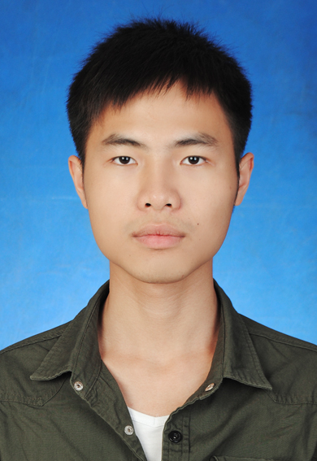

吴君彦</img>

## 基本情况

-
-
-
-

## 项目

#### IJCAI阿里妈妈搜索广告转化预测大赛rank 141/5204（2018.04-2018.06）（队长）

**简介：** 赛题内容是根据用户、广告商品、检索词、上下文内容、店铺等信息预测在**购物节当天**广告产生购买行为的概率。最后带领团队（共3人），使用lgb、xgb、lr，最终取得**决赛141名**。

**职责：**

- 使用matplotlab画图分析数据：转化率在不同时间粒度下的分布；各基础特征与转化率之间的关系图；特征之间的趋势变化图等等。
- 使用pandas、sklearn、numpy做特征工程：对缺失值做众数/均值填补；构造用户与商品，商品与时间等等各属性之间的交互特征，用户行为描述特征，商品和商店热度趋势特征，小时的转化率变化趋势特征等等。
-
