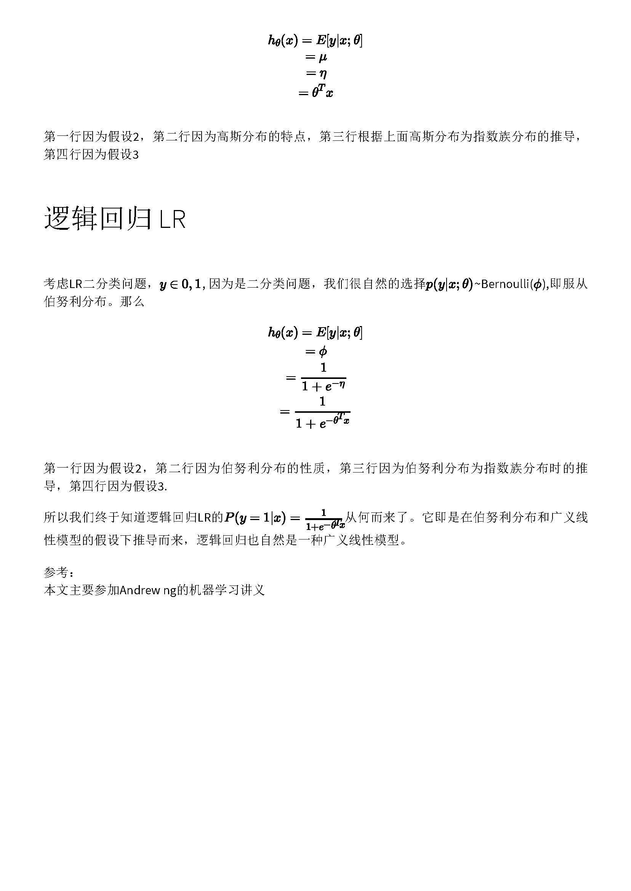

[toc]

# lr相关问题

**参考资料**：

- [lr为什么要使用sigmoid](https://www.zhihu.com/question/35322351)

---

## sigmoid 怎么来的？

```flow
st=>start: sigmoid
op0=>operation: 指数分布族具有最大熵性质
op1=>operation: 假设是二分类问题，服从伯努利分布
op2=>operation: 化为指数分布族形式
op3=>operation: 得到y=sigmoid
e=>end: End
st->op0->op1->op2->op3->e
```




---

## lr推导

```flow
st=>start: Start
op0=>sigmoid
op1=>operation: 写成二项分布形式
op2=>operation: 用最大似然概率，连乘
op3=>operation: 取log
op4=>operation: 由于一般是min(Obj)，加负号
e=>end: Obj
st->op1->op2->op3->op4->e
```

有了概率预测模型（sigmoid）后，我们就可以将二分类问题写成伯努利二项分布形式，用最大似然概率的方法连乘，取log，加负号，即为我们需要优化的目标函数。
