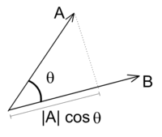
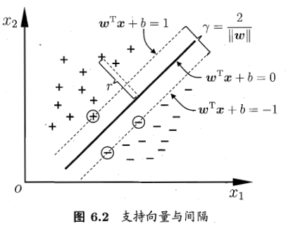

# SVM

通俗来讲就是求一个能够划分数据的超平面，并且使得平面位于两类数据的正中间，使得间隔最大化。

## 预备知识

**多维点到超平面距离**

推导过程：

设点$x_1$在平面$wx+b=0$上的投影为$x_0$，d为点$x_1$到平面的距离，则平面的法向量$w$与$\overrightarrow{x_1x_0}$平行。于是有

$$\begin{aligned}
\overrightarrow{w} \cdot \overrightarrow{x_1x_0} &= |\overrightarrow{w}||\overrightarrow{x_1x_0}|cos\theta \\
&= |\overrightarrow{w}||\overrightarrow{x_1x_0}| \\
&= |\overrightarrow{w}|d
\end{aligned} \tag{1}$$

又

$$\begin{aligned}
|\overrightarrow{w} \cdot \overrightarrow{x_1x_0}| &= |w^0(x_1^0 - x_0^0) + w^1(x_1^1 - x_0^1) + ... + w^n(x_1^n - x_0^n)| \\
&= |(w^0x^0_1+w^1x^1_1+...+w^nx^n_1) - (w^0x^0_0+w^1x^1_0+...+w^nx^n_0)| \\
&= |(w^0x^0_1+w^1x^1_1+...+w^nx^n_1) - (w^0x^0_0+w^1x^1_0+...+w^nx^n_0) - b + b | \\
&= |(w^0x^0_1+w^1x^1_1+...+w^nx^n_1) + 0 + b| \\
&= |\overrightarrow{w} \overrightarrow{x} + b|
\end{aligned} \tag{2}$$

将（1）代入（2），有

$$\begin{aligned}
||\vec{w}|| d &= |\vec{w} \vec{x} + b| \\
d &= \frac{|\vec{w} \vec{x} + b|}{||\vec{w}||}
\end{aligned}$$

**什么是点积/内积？**

点积：$\vec{a} \cdot \vec{b} = |\vec{a}||\vec{b}|cos\theta$，它相当于向量$\vec{a}$在向量$\vec{b}$上的投影的长度，跟$|\vec{b}|$做乘法运算。

---

## 正式开讲

设超平面$w^Tx+b=0$，则有

$$
\begin{cases}
w^Tx+b \ge 0, & y_i = +1 \\
w^Tx+b \le 0, & y_i = -1
\end{cases}
\tag{3}$$

找距离超平面最近的几个样本

- 对偶问题——将SVM的优化问题用拉格朗日乘子法得到其对偶问题
